<div align="center">
  <a href="https://telcochisel.com">
    
  </a>
  <br/><br/>

  # TelcoChisel OS
  ### Advanced Telecom Security Distribution for Cellular Auditing, SDR Engineering & Baseband Research

  [](https://github.com/TelcoSec-Tools/TelcoChiselOS/actions/workflows/release.yml)
  [](https://github.com/TelcoSec-Tools/TelcoChiselOS/actions/workflows/ci.yml)
  [](https://ubuntu.com)
  [](https://telcochisel.com)
  [](https://telcochisel.com/#tools)
  [](https://github.com/orgs/TelcoSec-Tools/packages)
  [](https://sourceforge.net/projects/telcochisel/files/latest/download)
  [](LICENSE)
  [](https://telcochisel.com)
  [](https://app.telcosec.net)

  <br/><br/>

  [**Official Documentation**](https://telcochisel.com) • [**Download Live ISO**](https://sourceforge.net/projects/telcochisel/files/latest/download) • [**VM Appliances**](docs/VM_APPLIANCE_GUIDE.md) • [**Container Registry**](https://github.com/orgs/TelcoSec-Tools/packages) • [**TelcoSec Academy**](https://app.telcosec.net) • [**Discord**](https://discord.gg/RykzXTQFXF)
  <br/>
  [**Release Architecture**](RELEASES.md) • [**Changelog**](CHANGELOG.md) • [**DistroWatch Spec**](DISTROWATCH.md) • [**Contributing**](CONTRIBUTING.md) • [**Security Policy**](SECURITY.md)

  ---

  **Default Credentials (Live / VM):** Username: `telcosec` | Password: `telcosec` *(Automatic GUI Login)*
</div>

---

## Executive Overview

**TelcoChisel OS** is a specialized, production-ready Linux operating system developed by **[TelcoSec](https://telco-sec.com)** for telecommunications security auditors, 5G Standalone (SA) and O-RAN penetration testers, cellular baseband vulnerability researchers, and Software Defined Radio (SDR) engineers.

Built on an **Ubuntu 24.04 LTS (Noble Numbat)** foundation with a dedicated **Low-Latency 1000Hz Real-Time Kernel** (`linux-image-lowlatency`), TelcoChisel delivers an air-gapped, turn-key research laboratory equipped with **100 pre-compiled and verified telecom security instruments across 11 functional domains**.

```mermaid
flowchart TD
    subgraph L1["1. Physical & RF Transceiver Layer"]
        USB["USB 3.0 / 2.0 SDRs<br/>(USRP B210, HackRF, BladeRF 2.0, LimeSDR, RTL-SDR)"]
        SFP["10GbE SFP+ Transceivers<br/>(USRP X310, N310, N320, X410)"]
        DIAG["Diagnostic Modems & Hardware<br/>(Qualcomm DIAG, MTK BROM, EDL 9008, Balong)"]
        SIM["Smartcard & SIM Trace Probes<br/>(Sysmocom SIMtrace 2, CCID PC/SC Readers)"]
    end

    subgraph L2["2. Real-Time OS & Zero-Drop Tuning Layer"]
        KERN["Low-Latency Kernel (1000Hz, CONFIG_PREEMPT=y)"]
        MEM["Unlimited RLIMIT_MEMLOCK & Realtime Priority (SCHED_RR 99)"]
        NET["10GbE Network Stack: MTU 9000 Jumbo Frames | 4096 Rings | 64MB Sockets"]
        USBBUF["High-Throughput USB Subsystem: usbfs_memory_mb=1000 | Autosuspend Disabled"]
        SCTP["Telecom Signaling Stack: Low RTO (200ms) | Fast Failover | 64MB Buffers"]
    end

    subgraph L3["3. Unified Operator Architecture"]
        TELCOSEC["telcosec<br/>(Hardware Probe, 5G Core Lifecycle, Guided Scans, Diagnostic Doctor)"]
        TELCOSDR["telcosec-sdr<br/>(Driver Stacks, USBFS Allocation, 10GbE Tuning, Offline FPGA Bitstreams)"]
        TELCOPKG["telcosec-pkg<br/>(11-Tier Modular Metapackage Client via meta.telcosec.net)"]
    end

    subgraph L4["4. 100 Pre-Configured Telecom Instruments (11 Categories)"]
        C01["01. SDR & RF DSP (GNU Radio 3.10, UHD, Gqrx, URH, Inspectrum)"]
        C02["02. GSM & 2G Stacks (OsmocomBB, OpenBTS, YateBTS, OsmoGSM)"]
        C03["03. LTE & 4G RAN (srsRAN, srsUE, LTE-CellScanner, LTESniffer)"]
        C04["04. 5G NR & O-RAN (Open5GS, UERANSIM, O-RAN E2/O1, 5Ghoul, OAI)"]
        C05["05. Baseband & Modems (FirmWire, QCSuper, SCAT, MTKClient, Balong)"]
        C06["06. SIM & Smartcards (pySim, SIMtrace 2, lpac, SIMurai, SIMtester)"]
        C07["07. Core Network (SigPloit, Diafuzzer, sctpscan, 5G SBI Fuzzers)"]
        C08["08. Mobile Device (EDL 9008, Fastboot, Heimdall, AT Console)"]
        C09["09. Network & Wireline (mausezahn, RDNSx, asleap, VLAN QinQ)"]
        C10["10. VoIP & Telecom PBX (SIPVicious, SIPp, sipsak, voiphopper, rtpbleed)"]
        C11["11. TelcoChisel Engine (Offline Docs, Profile Switcher, USB Creator)"]
    end

    subgraph L5["5. Multi-Form Factor Deployment"]
        ISO["Bootable Live ISO (Hardware Bare-Metal, Encrypted LUKS Persistence, Toram)"]
        VM["Virtual Appliances (Proxmox QCOW2, VMware OVA, VirtualBox OVA)"]
        CONTAINERS["Container Ecosystem (Docker, Podman Kube, Kubernetes Manifests)"]
        ACADEMY["TelcoSec Academy (Interactive Guided Field Labs & CTF Testbeds)"]
    end

    L1 --> L2
    L2 --> L3
    L3 --> L4
    L4 --> L5
```



---

## Why Choose TelcoChisel OS?

| Capability | Standard Linux (Kali / Ubuntu) | Typical Manual Setup | TelcoChisel OS |
| :--- | :--- | :--- | :--- |
| **RF / SDR Scheduling** | Generic desktop scheduler; drops I/Q samples under high load | Manual kernel patching; breaks on routine package updates | **1000Hz Low-Latency Kernel** (`CONFIG_PREEMPT=y`) pre-configured |
| **Telecom Toolset** | Generic penetration testing focus; missing 5G SA, O-RAN, Baseband | Complex dependency builds; frequent Python 2/3 and UHD/GR conflicts | **100 pre-compiled telecom instruments** across 11 dedicated suites |
| **High-Bandwidth Network** | Default 1500 MTU and small buffers drop packets >50 MSps | Manual `sysctl` and `ethtool` tuning required on every reboot | **One-command zero-drop tuning** (`telcosec sdr 10g tune`) with 64MB buffers |
| **Field Air-Gap Readiness** | Requires live internet to fetch documentation and dependencies | Unreliable in Faraday cages, SCIF environments, and remote field sites | **100% self-contained**: offline documentation, bitstreams, and schemas |
| **Deployment Flexibility** | Live USB only | Varies by administrator | **Live ISO, Proxmox, VMware, VirtualBox, Docker, Podman, and WSL2** |

### Target Audience

* **Telecom Security Auditors & Mobile Network Operators (MNOs)**: Validate 5G SA Core security, 3GPP Service Based Architecture (SBA) REST APIs, O-RAN E2/O1 interfaces, and SS7/Diameter roaming interconnects against GSMA guidelines (FS.11, FS.19, FS.34).
* **Red Teams & Penetration Testers**: Deploy rogue base station simulations (UERANSIM, srsRAN, 5Ghoul), audit cellular baseband firmware (Qualcomm DIAG, MediaTek BROM, Samsung Shannon), perform Voice VLAN hopping, and conduct over-the-air cellular fuzzing.
* **Government, Defense & Critical Infrastructure**: Conduct air-gapped RF spectrum surveillance, satellite Non-Terrestrial Network (NTN) Doppler signal interception, SIM card APDU extraction, and communications resilience evaluations.
* **Academic Researchers & Defense Labs**: Spin up reproducible, standardized testbeds for 5G, LTE, and SDR research without managing complex local build pipelines.

---

## Core Architectural Pillars

### 1. Deterministic Real-Time Radio Frequency (RF) Subsystem
High-bandwidth SDR transceivers (USRP X310, B210, BladeRF 2.0, LimeSDR) stream millions of I/Q samples per second. Standard operating systems drop packets due to process scheduling latency and restrictive buffer limits.
* **Low-Latency Kernel**: Preemptible scheduler tuned for sub-millisecond process wakeups.
* **Unlimited Memory Locking**: Dedicated PAM configuration grants the `realtime` group `SCHED_RR` priority 99 and unlimited locked memory (`RLIMIT_MEMLOCK=unlimited`).
* **High-Throughput USB Buffering**: Pre-allocates `usbcore.usbfs_memory_mb=1000` and disables autosuspend across all supported SDR vendor IDs.
* **Zero-Drop 10GbE Network Stack**: Instant MTU 9000 Jumbo Frame configuration, 4096 ring descriptors, and 64MB socket buffers (`net.core.rmem_max=67108864`).

### 2. Complete 5G Standalone (SA) & O-RAN Audit Suite
* **Full Local 5G Core**: Pre-configured **Open5GS** instance with automated subscriber provisioning and multi-slice configuration.
* **RAN Emulation & Concurrency**: **UERANSIM** and **my5G-RANTester** for gNodeB simulation and high-density UE load testing.
* **O-RAN Testing**: Specialized modules for **O-RAN E2 Node Simulation** (`oran-e2sim`) and **O1 NETCONF/YANG Auditing** (`oran-o1-audit`).
* **5G SBI REST & mTLS Fuzzers**: Dedicated mutational fuzzers (`5g-sbi-fuzzer`) and OpenAPI specification validators (`5g-sbi-validator`) referencing bundled 3GPP Rel-15–18 schemas.
* **Over-the-Air Fuzzing**: **5Ghoul** integration for auditing commercial 5G modem firmware resilience against rogue gNB signaling.

### 3. Pure Go Smartcard, SIM & eSIM Analysis Engine
TelcoChisel embeds a zero-CGO smartcard and eSIM inspection engine into the `telcosec` CLI:
* **Automated ISO/IEC 7816-3 ATR Decoder**: Instant calculation of baud rate conversion factors ($F_i/D_i$, work etu), historical byte parsing, and profile detection (GSM, USIM, ISIM).
* **Hardware Interception**: Full integration with **Sysmocom SIMtrace 2** for live APDU sniffing and GSMTAP streaming into Wireshark.
* **eSIM Local Profile Assistant (LPA)**: Integrated **`lpac`** tooling for inspecting GSMA SGP.22 eSIM chips, security metadata, and profile packages.
* **Card File System Exploration**: Integrated **`pySim-shell`** and **`SIMtester`** for card file system traversal and cryptographic evaluation.

### 4. Baseband Firmware Emulation & Diagnostics
* **Virtual Baseband Emulation**: **FirmWire** platform for dynamic emulation and fuzzing of Samsung Shannon and MediaTek baseband firmware without physical device bricking risks.
* **Diagnostic Protocol Decoders**: **QCSuper** and **SCAT** for capturing Qualcomm DIAG, Samsung, and MediaTek logs and converting them to live PCAP/GSMTAP streams.
* **Low-Level Hardware Programmers**: BROM exploiters (**MTKClient**), Emergency Download (**EDL 9008**), **Balong-Flash**, and **Heimdall**.

### 5. Unified Operator Command Center (`telcosec`)
All operating system diagnostics, hardware drivers, cellular services, and domain suites are centralized under the zero-dependency binary **`telcosec`** (symlinked to `telcochisel`):

```bash
telcosec check             # Run pre-flight audit of kernel latency, PAM limits, and services
telcosec hardware          # Automatically enumerate connected SDRs, modems, and SIM readers
telcosec 5g-sa start       # Orchestrate local Open5GS 5G Standalone core network
telcosec sim atr [hex]     # Decode ISO 7816-3 smartcard ATR parameters and telecom profile
telcosec sdr 10g tune eth0 # Optimize 10GbE network interface for zero-drop USRP X310/N310 streaming
telcosec search <query>    # Query the offline catalog across all 100 pre-installed instruments
telcosec docs              # Launch local offline documentation portal in default browser
```

---

## 11 Curated Telecom Security Domains

Tools in TelcoChisel are organized into 11 distinct XFCE desktop categories with dedicated vector icons and application launchers:

| Category | Domain Suite | Featured Instruments & Frameworks |
| :--- | :--- | :--- |
| **01** | **Software Defined Radio (SDR)** | GNU Radio 3.10, UHD, SoapySDR, Gqrx, URH, Inspectrum, Gpredict, Satellites |
| **02** | **GSM & 2G Infrastructure** | OsmocomBB, OpenBTS, YateBTS, OsmoGSM, Kalibrate-GSM, gr-gsm |
| **03** | **LTE & 4G RAN Simulation** | srsRAN 4G, srsUE, LTESniffer, LTE-CellScanner |
| **04** | **5G NR & O-RAN Engineering** | Open5GS, UERANSIM, O-RAN E2 Node, O-RAN O1 Auditor, 5Ghoul, my5G-RAN |
| **05** | **Baseband & Mobile Firmware** | FirmWire, QCSuper, SCAT, MTKClient, Balongtool, EDL Programmer, atinout |
| **06** | **SIM & Smartcard Auditing** | Sysmocom SIMtrace 2, pySim-shell, lpac eSIM LPA, SIMurai, SIMtester |
| **07** | **Core Network & Signaling** | SigPloit (SS7/Diameter/GTP), Diafuzzer, 5G SBI Fuzzer, sctpscan, Scapy |
| **08** | **Mobile Device & Hardware Access** | Android ADB/Fastboot, Heimdall, Qualcomm EDL 9008, SP Flash Tool |
| **09** | **Network, Wireline & Transport** | mausezahn (mz), RDNSx, asleap, docsis, yersinia, VLAN QinQ, snmp-check |
| **10** | **VoIP & Telecom PBX Auditing** | SIPVicious, SIPp, sipsak, voiphopper (Voice VLAN), rtpbleed, Baresip |
| **11** | **TelcoChisel OS System & Control** | TelcoSec Doctor, Metapackage Manager (`telcosec-pkg`), Offline Docs, USB Creator |

> [!TIP]
> **Interactive Tool Catalog**: For full command-line arguments, usage recipes, and protocol references for each tool, visit the [**TelcoChisel Online Tool Directory**](https://telcochisel.com/#tools) or run `telcosec docs` in the OS.

---

## Deployment Form Factors

TelcoChisel OS is distributed across four distinct deployment targets to accommodate physical hardware, enterprise hypervisors, and containerized pipelines:

```
┌────────────────────────────────────────────────────────────────────────────────────────┐
│                               TELCOCHISEL DEPLOYMENT MATRIX                            │
├─────────────────────┬──────────────────┬─────────────────┬─────────────────────────────┤
│ Target              │ Package Format   │ Typical Use     │ Key Advantage               │
├─────────────────────┼──────────────────┼─────────────────┼─────────────────────────────┤
│ 1. Bare-Metal Live  │ Hybrid ISO       │ Field audits    │ 1000Hz Kernel, raw USB/10G  │
│ 2. Proxmox VE / KVM │ Thin .qcow2      │ Lab testbeds    │ Cloud-Init, VirtIO-SCSI     │
│ 3. VMware / VBox    │ Pre-built .ova   │ Workstation VMs │ open-vm-tools, VMXNET3      │
│ 4. GHCR Containers  │ OCI Container    │ CI/CD pipelines │ Lightweight, multi-arch     │
└─────────────────────┴──────────────────┴─────────────────┴─────────────────────────────┘
```

### 1. Live ISO (Physical Hardware)
* **Flagship Field Edition** (`TelcoChisel-2026.2-amd64.iso`, ~5.5 GB): Fully self-contained, air-gapped research lab with all 100 tools pre-compiled, offline UHD FPGA bitstreams, and Conda SDR environment.
* **Modular Lite Edition** (`TelcoChisel-2026.2-lite-amd64.iso`, ~1.8 GB): Base desktop with core networking and the `telcosec-pkg` client to pull domain suites on demand from `meta.telcosec.net`.
* **Four Boot Modes**:
  1. *TelcoChisel Live (Default)*: Low-latency desktop with auto-configured hardware access.
  2. *Encrypted Persistence*: AES-XTS LUKS-encrypted `casper-rw` partition for secure evidence and PCAP storage.
  3. *RAM Mode (`toram`)*: Copies the root filesystem to RAM, freeing the USB drive for removal.
  4. *i3 Tiling Window Manager*: Ultra-lightweight, keyboard-driven session for resource-constrained field laptops.

### 2. Pre-Built Virtual Appliances (Proxmox, VMware, VirtualBox)
Ready-to-import virtual machine appliances with pre-configured guest agents and optimal virtual hardware settings:
* **Proxmox VE / KVM**: `TelcoChisel-2026.2-Proxmox.qcow2` (VirtIO SCSI, QEMU Guest Agent, Cloud-Init ready).
* **VMware Workstation & ESXi**: `TelcoChisel-2026.2-VMware.ova` (`open-vm-tools-desktop`, VMXNET3, USB 3.1 xHCI).
* **Oracle VirtualBox**: `TelcoChisel-2026.2-VirtualBox.ova` (`virtualbox-guest-x11`, USB 3.0 passthrough).

> [!NOTE]
> Detailed import commands, hardware passthrough instructions, and memory allocation tips are documented in the [**Virtual Machine Appliance Deployment Guide**](docs/VM_APPLIANCE_GUIDE.md).

### 3. Official GHCR Container Images
Pre-built multi-stage container images published to the GitHub Container Registry:

| Container Image | Scope & Included Tools |
| :--- | :--- |
| `ghcr.io/telcosec-tools/telcochisel-base:latest` | Base runtime, `telcosec` CLI, Scapy, network utilities |
| `ghcr.io/telcosec-tools/telcochisel-sdr:latest` | GNU Radio 3.10, UHD, SoapySDR, RTL-SDR, HackRF, BladeRF |
| `ghcr.io/telcosec-tools/telcochisel-core-network:latest` | Open5GS 5G SA core, UERANSIM gNB/UE, SigPloit, Diafuzzer |
| `ghcr.io/telcosec-tools/telcochisel-device-tools:latest` | Android ADB/Fastboot, QCSuper, SCAT, pySim, lpac eSIM |

### 4. Interactive Deployment Manager (`deploy_menu.sh`)
TelcoChisel provides a unified launcher for running containers, launching telecom pods, or triggering builds:

```bash
# Launch the interactive deployment manager
./deploy_menu.sh
```

---

## Quick Start

### 1. Download & Verify Checksums

Download the official ISO images from SourceForge:

* [**Download Flagship Field Edition (SourceForge)**](https://sourceforge.net/projects/telcochisel/files/latest/download)
* [**Browse All Editions, Appliances & Checksums**](https://sourceforge.net/projects/telcochisel/files/)

Verify image integrity prior to flashing:

```bash
# Linux / macOS SHA-256 Verification
sha256sum -c TelcoChisel-2026.2-amd64.iso.sha256

# Windows PowerShell SHA-256 Verification
Get-FileHash .\TelcoChisel-2026.2-amd64.iso -Algorithm SHA256
```

### 2. Flashing to USB Flash Drive

```bash
# Direct Block Write (Linux / macOS — replace /dev/sdX with target drive)
sudo dd if=TelcoChisel-2026.2-amd64.iso of=/dev/sdX bs=4M status=progress conv=fsync
```

* **Windows**: Flash with **Rufus** (select *DD Image Mode*) or copy directly into a **Ventoy** drive.
* **Encrypted Persistence**: Boot into Live mode and run `sudo telcosec-create-usb /dev/sdX` to format a persistent encrypted drive automatically.

### 3. Running Container Images

```bash
# Run the 5G Core Network container interactively
docker run --rm -it --net=host ghcr.io/telcosec-tools/telcochisel-core-network:latest

# Or launch a rootless multi-container Telecom Pod via Podman
podman play kube docker/pods/podman-telecom-pod.yaml
```

---

## Tactical Desktop Environment

TelcoChisel OS includes a custom-engineered XFCE 4.18 desktop environment optimized for RF engineering and field audits:

* **Zero-Drop FFT Display Engine**: Custom Picom GLX compositor (`use-damage = false`, `unredir-if-possible = true`) with explicit exclusions for `Gqrx`, `Inspectrum`, `URH`, and `Wireshark` to eliminate waterfall tearing during high-throughput I/Q streaming.
* **Top Panel Telemetry Probers**:
  * *SDR Prober*: Auto-detects connected USRP, HackRF, BladeRF, LimeSDR, RTL-SDR, and PlutoSDR transceivers.
  * *5G Core Monitor*: Displays live daemon state for Open5GS and srsRAN network functions.
  * *Tunnel & Network Monitor*: Real-time status for WireGuard (`wg0`), OpenVPN (`tun0`), and cellular modems (`wwan0`).
* **Tactical Conky HUD**: On-demand hardware and network heads-up display toggleable via **`Super + H`**.
* **Forensic Thunar File Manager**: Pre-configured with dedicated capture paths (`~/captures/{pcap,iq,apdu,evidence}`) and right-click actions for GSMTAP Wireshark decoding, Inspectrum playback, pySim-shell access, and SHA-256 evidence hashing.
* **7-Workspace Telecom Pager**: Dedicated virtual workspaces for RF & SDR, Cellular RAN, Core Network, Firmware & BB, Wireline & VoIP, Hardware & SIM, and Evidence & Logs.

---

## TelcoSec Ecosystem & Support

TelcoChisel is actively developed and maintained by **[TelcoSec](https://telco-sec.com)**.

* 📖 **Documentation Portal**: [https://telcochisel.com](https://telcochisel.com)
* 🎓 **TelcoSec Academy (Interactive Guided Labs)**: [https://app.telcosec.net](https://app.telcosec.net)
* 💬 **Discord Community Hub**: [https://discord.gg/RykzXTQFXF](https://discord.gg/RykzXTQFXF)
* 🌐 **Community Discussions**: [https://community.telcosec.net](https://community.telcosec.net)
* ⭐ **SourceForge Portal**: [https://sourceforge.net/projects/telcochisel/](https://sourceforge.net/projects/telcochisel/)

---

> [!CAUTION]
> **Responsible Use & Legal Notice**: TelcoChisel is designed solely for authorized telecommunications security assessments, academic research, and lawful penetration testing under written authorization. Radio frequency emissions and cellular intercept testing are subject to strict legal and regulatory frameworks. Operators are solely responsible for ensuring all activities comply with local telecommunications, privacy, and radio frequency spectrum allocation laws.
