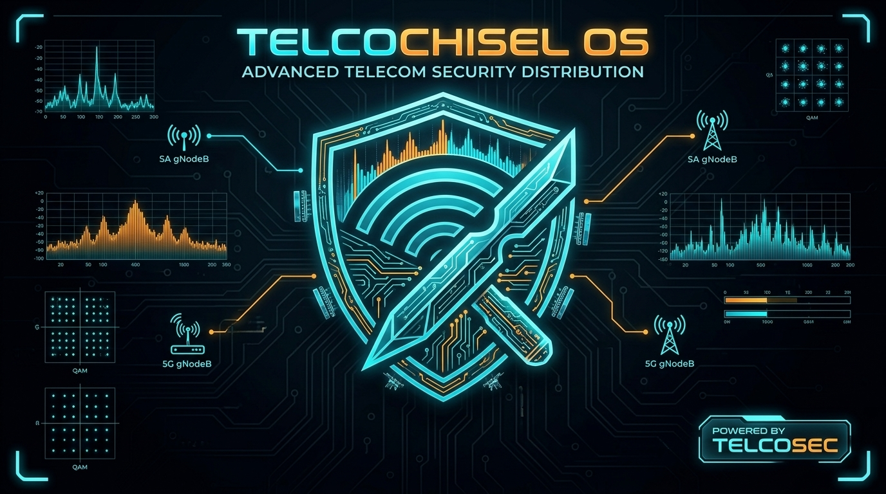

<div align="center">
  <a href="https://telcochisel.com">
    
  </a>
  <br/><br/>

  # TelcoChisel OS: Advanced Telecom Security Distribution
  ### The Definitive Operating System for Cellular Network Auditing, SDR Engineering & Baseband Research

  [](https://github.com/TelcoSec-Tools/TelcoChiselOS/actions/workflows/release.yml)
  [](https://github.com/TelcoSec-Tools/TelcoChiselOS/actions/workflows/ci.yml)
  [](https://telcochisel.com)
  [](DISTROWATCH.md)
  [](https://telcochisel.com/feed.xml)
  [](https://ubuntu.com)
  [](https://telcochisel.com)
  [](https://telcochisel.com/#tools)
  [](https://meta.telcosec.net)
  [](LICENSE)
  <br/>
  [](https://sourceforge.net/projects/telcochisel/files/latest/download)
  [](https://sourceforge.net/projects/telcochisel/files/)
  [](https://sourceforge.net/projects/telcochisel/files/)
  [](https://sourceforge.net/projects/telcochisel/reviews/new)

  <br/>

  <a href="https://sourceforge.net/projects/telcochisel/files/latest/download" target="_blank">
    
  </a>

  <br/><br/>

  [**Official Documentation**](https://telcochisel.com) • [**Download Live ISO**](https://sourceforge.net/projects/telcochisel/files/latest/download) • [**DistroWatch Spec**](DISTROWATCH.md) • [**Release Feed**](https://telcochisel.com/feed.xml) • [**SourceForge Portal**](https://sourceforge.net/projects/telcochisel/) • [**Discord**](https://discord.gg/RykzXTQFXF)
  <br/>
  [**Release Architecture**](RELEASES.md) • [**Changelog**](CHANGELOG.md) • [**Contributing**](CONTRIBUTING.md) • [**Security Policy**](SECURITY.md) • [**Code of Conduct**](.github/CODE_OF_CONDUCT.md)

  ---

  **Live Boot Credentials:** Username: `telcosec` | Password: `telcosec` *(Automatic GUI Login)*
</div>

---

## Executive Overview

**TelcoChisel OS** is a specialized, production-ready Linux operating system purpose-built by [TelcoSec](https://telco-sec.com) for telecommunications security audits, 5G Standalone (SA) and O-RAN penetration testing, cellular baseband vulnerability research, and Software Defined Radio (SDR) transceiver engineering.

Built upon an **Ubuntu 24.04 LTS (Noble Numbat)** foundation with a dedicated **Low-Latency Real-Time Kernel** (`linux-image-lowlatency`), TelcoChisel provides an air-gapped, turn-key research laboratory featuring **94 pre-compiled and verified telecom security instruments across 11 functional domains**.

```mermaid
flowchart TD
    subgraph L1["1. Physical & RF Transceiver Layer"]
        USB["USB 3.0 / 2.0 SDRs<br/>(USRP B210, HackRF, BladeRF 2.0, LimeSDR, RTL-SDR)"]
        SFP["10GbE SFP+ Transceivers<br/>(USRP X310, N310, N320, X410)"]
        DIAG["Diagnostic Modems & Hardware<br/>(Qualcomm DIAG, MTK BROM, EDL 9008, Balong)"]
        SIM["Smartcard & SIM Trace Probes<br/>(Sysmocom SIMtrace 2, CCID PC/SC Readers)"]
    end

    subgraph L2["2. Real-Time OS & Zero-Drop Tuning Layer"]
        KERN["Low-Latency Kernel (1000Hz, CONFIG_PREEMPT=y)"]
        MEM["Unlimited RLIMIT_MEMLOCK & Realtime Priority (SCHED_RR 99)"]
        NET["10GbE Network Stack: MTU 9000 Jumbo Frames | 4096 Rings | 64MB Sockets"]
        USBBUF["High-Throughput USB Subsystem: usbfs_memory_mb=1000 | Autosuspend Disabled"]
        SCTP["Telecom Signaling Stack: Low RTO (200ms) | Fast Failover | 64MB Buffers"]
    end

    subgraph L3["3. Unified Operator Architecture"]
        TELCOSEC["telcosec<br/>(Hardware Probe, 5G Core Lifecycle, Guided Scans, Diagnostic Doctor)"]
        TELCOSDR["telcosec-sdr<br/>(Driver Stacks, USBFS Allocation, 10GbE Tuning, Offline FPGA Bitstreams)"]
        TELCOPKG["telcosec-pkg<br/>(11-Tier Modular Metapackage Client via meta.telcosec.net)"]
    end

    subgraph L4["4. 94 Pre-Configured Telecom Instruments (11 Categories)"]
        C01["01. SDR & RF DSP (GNU Radio 3.10, UHD, Gqrx, URH, Inspectrum)"]
        C02["02. GSM & 2G Stacks (OsmocomBB, OpenBTS, YateBTS, OsmoGSM)"]
        C03["03. LTE & 4G RAN (srsRAN, srsUE, LTE-CellScanner, LTESniffer)"]
        C04["04. 5G NR & O-RAN (Open5GS, UERANSIM, O-RAN E2/O1, 5Ghoul, OAI)"]
        C05["05. Baseband & Modems (FirmWire, QCSuper, SCAT, MTKClient, Balong)"]
        C06["06. SIM & Smartcards (pySim, SIMtrace 2, lpac, SIMurai, SIMtester)"]
        C07["07. Core Network (SigPloit, Diafuzzer, sctpscan, 5G SBI Fuzzers)"]
        C08["08. Mobile Device (EDL 9008, Fastboot, Heimdall, AT Console)"]
        C09["09. Network & Wireline (mausezahn, RDNSx, asleap, VLAN QinQ)"]
        C10["10. VoIP & Telecom PBX (SIPVicious, SIPp, sipsak, voiphopper, rtpbleed)"]
        C11["11. TelcoChisel Engine (Offline Docs, Profile Switcher, USB Creator)"]
    end

    subgraph L5["5. High-Assurance Field Delivery"]
        ISO["Bootable Live ISO (Standard Live, Encrypted LUKS Persistence, Toram, i3 WM)"]
        PODS["Telecom Container Pods (Rootless Podman Kube & Kubernetes Manifests)"]
        ACADEMY["TelcoSec Academy (Interactive Guided Field Labs & CTF Testbeds)"]
    end

    L1 --> L2
    L2 --> L3
    L3 --> L4
    L4 --> L5
```



---

## Strategic Value & Target Audience

TelcoChisel eliminates the weeks of fragile compilation, kernel patching, driver mismatches, and ABI conflicts typically required to assemble a functional telecom security workstation.

```
┌─────────────────────────────────────────────────────────────────────────────────────────┐
│                               WHY CHOOSE TELCOCHISEL OS?                                │
├───────────────────────────────┬───────────────────────────────┬─────────────────────────┤
│ Standard Linux (Kali / Ubuntu)│ Typical Manual Build          │ TelcoChisel OS          │
├───────────────────────────────┼───────────────────────────────┼─────────────────────────┤
│ ❌ Generic desktop scheduler  │ ⚠️ Kernel tuning breaks on OS │ ✅ 1000Hz Low-Latency   │
│   causes SDR I/Q sample drops │    updates; high jitter       │    Kernel pre-tuned     │
├───────────────────────────────┼───────────────────────────────┼─────────────────────────┤
│ ❌ Generic pentest focus      │ ⚠️ Fragile Python 2/3 and     │ ✅ 94 telecom-specific  │
│   (missing 5G, O-RAN, Baseband)│    UHD/GNU Radio conflicts    │    tools across 11 suites│
├───────────────────────────────┼───────────────────────────────┼─────────────────────────┤
│ ❌ Default network stack drops│ ⚠️ Manual MTU and buffer      │ ✅ One-command 10GbE &  │
│   packets at >50 MSps sample  │    sysctl tuning required     │    USB zero-drop tuning │
├───────────────────────────────┼───────────────────────────────┼─────────────────────────┤
│ ❌ Requires internet access   │ ⚠️ Cloud downloads needed     │ ✅ 100% offline & air-  │
│   to pull packages & configs  │    during field engagements   │    gapped field-ready   │
└───────────────────────────────┴───────────────────────────────┴─────────────────────────┘
```

### Who Uses TelcoChisel?

* 🛡️ **Telecom Security Auditors & Mobile Network Operators (MNOs)**: Validate 5G SA Core security, 3GPP Service Based Architecture (SBA) REST APIs, O-RAN E2/O1 interfaces, and SS7/Diameter roaming interconnects against GSMA fraud and interception guidelines (FS.11, FS.19, FS.34).
* ⚔️ **Red Teams & Penetration Testers**: Deploy rogue base station simulations (UERANSIM, srsRAN, 5Ghoul), audit cellular basebands (Qualcomm DIAG, MediaTek BROM, Samsung Shannon), perform Voice VLAN hopping, and conduct over-the-air cellular fuzzing.
* 🏛️ **Government, Defense & Critical Infrastructure**: Perform air-gapped forensic investigations, satellite and Non-Terrestrial Network (NTN) Doppler signal interception, SIM card APDU extraction, and communications resilience testing in secure facilities (SCIFs) and Faraday enclosures.
* 🎓 **Academic Researchers & Defense Labs**: Rapidly spin up standardized, repeatable testbeds for 5G, LTE, and SDR research without managing complex local build pipelines.

---

## Core Architectural Pillars

### 1. Deterministic Real-Time Radio Frequency (RF) Subsystem
High-bandwidth SDR transceivers (e.g., USRP X310, B210, BladeRF, LimeSDR) stream millions of I/Q samples per second. Standard operating systems drop packets due to process scheduling latency and restrictive USB/Ethernet buffers.
* **Low-Latency Real-Time Kernel**: Preemptible scheduler configured for sub-millisecond process wakeups.
* **Unrestricted Memory & Priority**: Dedicated PAM limits grant members of the `realtime` group `SCHED_RR` priority 99 and unlimited locked memory (`RLIMIT_MEMLOCK=unlimited`).
* **High-Throughput USB Buffering**: Kernel command line pre-allocates `usbcore.usbfs_memory_mb=1000` and disables autosuspend across all supported SDR vendor IDs.
* **Zero-Drop 10GbE Tuning**: `telcosec-sdr 10g tune` instantly applies Jumbo Frames (MTU 9000), expands ring descriptors to 4096, and configures 64MB socket buffers (`net.core.rmem_max=67108864`).

### 2. Complete 5G Standalone (SA) & O-RAN Audit Suite
* **Full Local 5G Core**: Pre-configured **Open5GS** instance with automated subscriber provisioning and multi-slice configuration.
* **RAN Emulation & Concurrency**: **UERANSIM** and **my5G-RANTester** for gNodeB simulation and high-density UE load testing.
* **O-RAN Testing**: Specialized launchers and CLI modules for **O-RAN E2 Node Simulation** (`oran-e2sim`) and **O1 NETCONF/YANG Auditing** (`oran-o1-audit`).
* **5G SBI REST & mTLS Fuzzers**: Dedicated mutational fuzzers (`5g-sbi-fuzzer`) and OpenAPI specification validators (`5g-sbi-validator`) referencing bundled 3GPP Rel-15–18 schemas.
* **Over-the-Air Fuzzing**: **5Ghoul** fuzzer integration for testing commercial 5G modem firmware resilience against rogue gNB signaling.

### 3. Pure Go Smartcard, SIM & eSIM Analysis Engine
TelcoChisel embeds a zero-CGO smartcard and eSIM inspection suite into the `telcosec` CLI:
* **Automated ISO/IEC 7816-3 ATR Decoder**: Instant calculation of baud rate conversion factors ($F_i/D_i$, work etu), historical byte parsing, and profile detection (GSM, USIM, ISIM).
* **Hardware Interception**: Full integration with **Sysmocom SIMtrace 2** for live APDU sniffing and GSMTAP streaming into Wireshark.
* **eSIM Local Profile Assistant (LPA)**: Integrated **`lpac`** tooling for inspecting GSMA SGP.22 eSIM chips, security metadata, and installed profile packages.
* **Smartcard Exploration**: Integrated **`pySim-shell`** and **`SIMtester`** for card file system traversal and crypto key evaluation.

### 4. Baseband Firmware Emulation & Diagnostic Tooling
* **Virtual Baseband Emulation**: **FirmWire** emulation platform for fuzzing Samsung Shannon and MediaTek baseband firmware without physical device bricking risks.
* **Diagnostic Protocol Decoders**: **QCSuper** and **SCAT** for capturing Qualcomm DIAG, Samsung, and MediaTek logs and converting them to live PCAP/GSMTAP streams.
* **Low-Level Hardware Programmers**: BROM exploiters (**MTKClient**), Emergency Download (**EDL 9008**), **Balong-Flash**, and **Heimdall**.

### 5. Unified Operator Command Center (`telcosec`)
All OS diagnostics, hardware drivers, cellular services, and domain suites are centralized under the zero-dependency Go binary **`telcosec`** (symlinked to `telcochisel`):

```bash
telcosec check             # Run pre-flight audit of kernel latency, PAM limits, and services
telcosec hardware          # Automatically enumerate connected SDRs, modems, and SIM readers
telcosec 5g-sa start       # Orchestrate local Open5GS 5G Standalone core network
telcosec sim atr [hex]     # Decode ISO 7816-3 smartcard ATR parameters and telecommunications profile
telcosec sdr 10g tune eth0 # Optimize 10GbE network interface for zero-drop USRP X310/N310 streaming
telcosec search <query>    # Query the offline catalog across all 94 pre-installed instruments
telcosec docs              # Launch local offline documentation portal in default browser
```

---

## 11 Curated Telecom Security Domains

Tools in TelcoChisel are organized into 11 distinct XFCE desktop categories with dedicated cyberpunk vector icons and application launchers:

```
┌──────────────────────────────────────┬────────────────────────────────────────────────────────────────────────┐
│ Domain Category                      │ Featured Instruments & Frameworks                                      │
├──────────────────────────────────────┼────────────────────────────────────────────────────────────────────────┤
│ 01. Software Defined Radio (SDR)     │ GNU Radio 3.10, UHD, SoapySDR, Gqrx, URH, Inspectrum, Gpredict, Satellites│
│ 02. GSM & 2G Infrastructure          │ OsmocomBB, OpenBTS, YateBTS, OsmoGSM, Kalibrate-GSM, gr-gsm           │
│ 03. LTE & 4G RAN Simulation          │ srsRAN 4G, srsUE, LTESniffer, LTE-CellScanner                          │
│ 04. 5G NR & O-RAN Engineering        │ Open5GS, UERANSIM, O-RAN E2 Node, O-RAN O1 Auditor, 5Ghoul, my5G-RAN    │
│ 05. Baseband & Mobile Firmware       │ FirmWire, QCSuper, SCAT, MTKClient, Balongtool, EDL Programmer, atinout│
│ 06. SIM & Smartcard Auditing         │ Sysmocom SIMtrace 2, pySim-shell, lpac eSIM LPA, SIMurai, SIMtester   │
│ 07. Core Network & Signaling         │ SigPloit (SS7/Diameter/GTP), Diafuzzer, 5G SBI Fuzzer, sctpscan, Scapy │
│ 08. Mobile Device & Hardware Access  │ Android ADB/Fastboot, Heimdall, Qualcomm EDL 9008, SP Flash Tool       │
│ 09. Network, Wireline & Transport    │ mausezahn (mz), RDNSx, asleap, docsis, yersinia, VLAN QinQ, snmp-check │
│ 10. VoIP & Telecom PBX Auditing      │ SIPVicious, SIPp, sipsak, voiphopper (Voice VLAN), rtpbleed, Baresip   │
│ 11. TelcoChisel OS System & Control  │ TelcoSec Doctor, Metapackage Manager (telcosec-pkg), Offline Docs, USB │
└──────────────────────────────────────┴────────────────────────────────────────────────────────────────────────┘
```

> [!TIP]
> **Complete Interactive Tool Catalog**: For full command-line arguments, usage recipes, and deep protocol documentation for each tool, explore the [**TelcoChisel Online Tool Directory**](https://telcochisel.com/#tools) or run `telcosec docs` directly in the OS.

---

## Distribution Flavors & Field Deployment

TelcoChisel is published in two official edition flavors:

| Edition Flavor | Primary ISO Image | Image Size | Deployment Scope |
| :--- | :--- | :--- | :--- |
| **Flagship Field Edition** *(Default)* | `TelcoChisel-2026.1-amd64.iso` | **~5.5 GB** | **100% Self-Contained & Air-Gapped**: All 94 tools pre-compiled, offline UHD FPGA bitstreams, Conda SDR environment, Open5GS, O-RAN, and 5Ghoul ready for immediate live execution without network access. |
| **Modular Lite Edition** | `TelcoChisel-2026.1-lite-amd64.iso` | **~1.8 GB** | **Minimal Footprint**: Base XFCE desktop, 1000Hz Low-Latency Kernel, Wireshark, and `telcosec-pkg` client to pull domain suites on-demand from `meta.telcosec.net`. |

### Four High-Assurance Boot Modes

When booting the Live USB media, the GRUB menu provides specialized operational modes:
1. **TelcoChisel OS Live (Low-Latency Realtime — Default)**: Boots into the full XFCE desktop environment with real-time audio, RF processing, and auto-configured hardware access.
2. **TelcoChisel OS Live (Encrypted Persistence)**: Mounts an AES-XTS LUKS-encrypted `casper-rw` partition for secure evidence preservation, custom PCAP storage, and report generation in the field.
3. **TelcoChisel OS Live (RAM Mode — Zero Trace)**: Copies the root filesystem entirely into RAM (`toram`), maximizing I/O performance and allowing the physical USB drive to be safely detached during operations.
4. **TelcoChisel OS Live (i3 Tiling Window Manager — RFS Style)**: Ultra-lightweight, keyboard-driven operational session minimizing CPU/RAM overhead on field laptops with 10 dedicated telecom workspaces.

---

## Quick Start & Verification

### 1. Download & Verify Checksums

Download the official ISO images directly from the high-speed SourceForge mirror network:

* **[Download Flagship Field Edition (SourceForge)](https://sourceforge.net/projects/telcochisel/files/latest/download)**
* **[Browse All Editions & Checksums](https://sourceforge.net/projects/telcochisel/files/)**

Always verify integrity prior to writing to physical flash media:

```bash
# Linux / macOS SHA-256 Verification
sha256sum -c TelcoChisel-2026.1-amd64.iso.sha256

# Windows PowerShell SHA-256 Verification
Get-FileHash .\TelcoChisel-2026.1-amd64.iso -Algorithm SHA256
```

### 2. Flashing to USB Flash Drive

```bash
# Direct Block Write (Linux / macOS — replace /dev/sdX with target drive)
sudo dd if=TelcoChisel-2026.1-amd64.iso of=/dev/sdX bs=4M status=progress conv=fsync
```

* **Windows Users**: Flash via **Rufus** in *DD Image Mode* or copy directly into a **Ventoy** drive.
* **Encrypted Persistence**: Boot into Live mode and execute `sudo telcosec-create-usb /dev/sdX` to format a persistent encrypted drive automatically.

---

## Containerized & Cloud Orchestration

For CI/CD testing, containerized testbeds, and headless cloud environments, TelcoChisel provides production-ready multi-container **Telecom PODs** under [`docker/pods/`](docker/pods/):

```bash
# Start rootless multi-container Telecom Pod (Core + Scanner sharing localhost)
podman play kube docker/pods/podman-telecom-pod.yaml

# Open interactive shell in the telecom scanner container
podman exec -it telcochisel-telecom-pod-telecom-scanner /bin/bash

# Deploy 5G Core testbed into Kubernetes
bash docker/pods/pod-deploy.sh apply-k8s docker/pods/k8s-5g-core-pod.yaml
```

---

## TelcoSec Ecosystem & Support

TelcoChisel is actively developed and maintained by **[TelcoSec](https://telco-sec.com)**.

* 📖 **Documentation Portal**: [https://telcochisel.com](https://telcochisel.com)
* 🎓 **TelcoSec Academy (Interactive Guided Labs)**: [https://app.telcosec.net](https://app.telcosec.net)
* 💬 **Discord Community Hub**: [https://discord.gg/RykzXTQFXF](https://discord.gg/RykzXTQFXF)
* 🌐 **Community Discussions**: [https://community.telcosec.net](https://community.telcosec.net)
* ⭐ **SourceForge Reviews**: [Rate TelcoChisel on SourceForge](https://sourceforge.net/projects/telcochisel/reviews/new)

---

> [!CAUTION]
> **Responsible Use & Legal Notice**: TelcoChisel is designed solely for authorized telecommunications security assessments, academic research, and lawful penetration testing under written authorization. Radio frequency emissions and cellular intercept testing are subject to strict legal regulations. Users are solely responsible for ensuring all activities comply with local telecommunications, privacy, and spectrum allocation laws.
