<div align="center">
  <br/>
  <a href="https://chisel.telcosec.net">
    
  </a>
  <br/><br/>

  # TelcoChisel: Advanced Telecom Security OS by TelcoSec

  **TelcoChisel is a specialized Live Linux distribution developed by TelcoSec for advanced Telecom Security, 4G/5G mobile network auditing, SDR transceiver engineering, and cellular baseband vulnerability research.**

  [](https://github.com/TelcoSec-Tools/TelcoChiselOS/actions/workflows/release.yml)
  [](https://github.com/TelcoSec-Tools/TelcoChiselOS/actions/workflows/ci.yml)
  [](https://chisel.telcosec.net)
  [](https://ubuntu.com)
  [](https://chisel.telcosec.net)
  [](https://chisel.telcosec.net/#tools)
  [](https://meta.telcosec.net)
  [](https://chisel.telcosec.net)
  [](docker/README.md)
  [](LICENSE)
  [](https://sourceforge.net/projects/telcochisel/files/latest/download)
  [](https://sourceforge.net/projects/telcochisel/reviews/new)

  [**Official Docs**](https://chisel.telcosec.net) • [**Download ISO**](https://sourceforge.net/projects/telcochisel/files/latest/download) • [**TelcoSec Academy**](https://app.telcosec.net) • [**Community Hub**](https://community.telcosec.net) • [**Discord Chat**](https://discord.gg/RykzXTQFXF)
  <br/>
  [**Changelog**](CHANGELOG.md) • [**Contributing Guide**](CONTRIBUTING.md) • [**Security Policy**](SECURITY.md)

  ---

  **Live Boot Credentials:** User: `telcosec` | Password: `telcosec`
</div>

---

## Overview

**TelcoChisel** is an operational live Linux environment configured for telecommunications security auditing, radio frequency analysis, and baseband research. 

Based on **Ubuntu 24.04 LTS (Noble Numbat)** with a dual-kernel architecture featuring the **low-latency real-time kernel** (`linux-image-lowlatency`) by default, an XFCE desktop environment, and an optional lightweight i3 tiling session, it ships with **88 pre-configured tools** for Software Defined Radio (SDR) operation, cellular RAN simulation (2G, 4G EPC & 5G SA), baseband firmware emulation, SIM/eSIM auditing, core signaling protocol analysis (SS7, Diameter, GTP, HTTP/2 SBI), wireline broadband exploitation, and VoIP telephony testing.

> [!NOTE]
> TelcoChisel boots directly from a USB flash drive or virtual machine, providing an isolated, pre-configured research testbed without modifying the host operating system. It includes support for **LUKS-encrypted persistence** (`casper-rw`), a **Toram mode** (copy-to-RAM for maximum I/O throughput), and can be permanently installed to disk via the bundled **Calamares GUI Installer**.

### System Architecture

```mermaid
flowchart TD
    subgraph L1["1. Physical & Transceiver Layer"]
        USB["USB 3.0 / 2.0 SDRs<br/>(B210, HackRF, BladeRF, LimeSDR, RTL-SDR)"]
        SFP["10GbE SFP+ / High-Throughput NICs<br/>(USRP X310, N310, N320, X410)"]
        DIAG["Diagnostic Serial & USB Modems<br/>(Qualcomm DIAG, MTK BROM, EDL 9008)"]
        SIM["Smartcard Readers & Trace Probes<br/>(Osmocom SIMtrace 2, CCID PC/SC)"]
    end

    subgraph L2["2. Real-Time Kernel & OS Tuning Layer"]
        KERN["Low-Latency Kernel (1000Hz, CONFIG_PREEMPT=y)"]
        MEM["Zero-Drop RLIMIT_MEMLOCK (unlimited) & SCHED_RR (prio 99)"]
        NET["10GbE Network Tuning: MTU 9000 | 4096 Ring Descriptors | 64MB Socket Buffers"]
        USBBUF["USB Subsystem: usbfs_memory_mb=1000 | USB Autosuspend Disabled"]
        SCTP["SCTP Stack: Low RTO (200ms) | Fast Failover | 64MB Kernel Buffers"]
    end

    subgraph L3["3. Unified Operator CLI Suite"]
        TELCOSEC["telcosec<br/>(Diagnostics, Hardware Discovery, 5G Core Orchestrator, Guided Scans)"]
        TELCOSDR["telcosec-sdr<br/>(USB & 10GbE Network Driver Tuning, FPGA Bitstreams, Benchmarks)"]
        TELCOPKG["telcosec-pkg<br/>(10-Tier Modular Metapackage Manager via meta.telcosec.net)"]
    end

    subgraph L4["4. 88 Pre-Configured Telecom Toolsets"]
        SDR_T["SDR & RF DSP<br/>(GNU Radio 3.10, UHD, Gqrx, gr-gsm, URH, Inspectrum, Gpredict)"]
        RAN_T["4G / 5G RAN & Core<br/>(Open5GS, UERANSIM, srsRAN, 5Ghoul, my5G-RANTester, mitmproxy)"]
        BB_T["Baseband & Mobile UE<br/>(FirmWire, QCSuper, SCAT, MTKClient, Balong)"]
        CORE_T["Signaling & Interconnect<br/>(SigPloit, Diafuzzer, sctpscan, Wireshark Profiles)"]
        SIM_T["SIM / eSIM Smartcards<br/>(pySim-shell, lpac, SIMurai, SIMtester, pcsc-tools, OpenSC)"]
        WIRE_T["Broadband, VoIP & Wireline<br/>(RouterSploit, docsis, asleap, sipp, voiphopper, rtpbleed, mausezahn)"]
    end

    subgraph L5["5. Operational Delivery & Ecosystem"]
        ISO["Live Hybrid ISO<br/>(Low-Latency Live, Encrypted casper-rw, i3 Tiling, Toram Mode)"]
        PODS["Telecom Container PODs<br/>(Rootless Podman 'play kube' & Kubernetes Pods in docker/pods/)"]
        ACADEMY["TelcoSec Academy<br/>(Interactive Hands-on Labs & Guided Learning Funnels at app.telcosec.net)"]
    end

    L1 --> L2
    L2 --> L3
    L3 --> L4
    L4 --> L5
```



---

## Quick Start & Download

TelcoChisel is distributed in two official editions:

| Edition | ISO Image | Size | Included Toolsets | Recommended Use Case |
| :--- | :--- | :--- | :--- | :--- |
| **Flagship Field Edition** *(Default)* | `TelcoChisel-3.0.0-amd64.iso` | **~5.0 GB** | All 88 telecom security tools, Low-Latency kernel, GNU Radio 3.10, Open5GS, 5Ghoul, UHD FPGA bitstreams, and SDR drivers. | 100% offline air-gapped field audits, SCIFs, Faraday cages, and bare-metal live engagements. |
| **Modular Lite Edition** | `TelcoChisel-3.0.0-lite-amd64.iso` | **~1.8 GB** | Base XFCE desktop, Low-Latency kernel, Wireshark, Python runtime, and `telcosec-pkg` CLI client. | Bandwidth-constrained deployments, VMs, cloud lab testing, and operators installing modular suites on-demand. |

### Download Mirrors
* **[Direct Download (SourceForge FRS)](https://sourceforge.net/projects/telcochisel/files/latest/download)** — High-speed, resumable download of the Flagship Field Edition.
* **[SourceForge All Files & Lite Edition](https://sourceforge.net/projects/telcochisel/files/)** — Browse all editions, checksums, and `.build-info.json` manifests.
* **[GitHub Releases Mirror](https://github.com/TelcoSec-Tools/TelcoChiselOS/releases)** — Multi-part archives with SHA-256 and MD5 verification.

### Writing to USB
```bash
# Linux / macOS (replace /dev/sdX with your USB drive)
sudo dd if=TelcoChisel-live.iso of=/dev/sdX bs=4M status=progress conv=fsync
```
Or use tools like **Rufus** (DD mode) or **Ventoy** on Windows. For persistent live environments, use the built-in `telcosec-create-usb` wizard.

---

## Unified Operator CLI (`telcosec`)

TelcoChisel provides a centralized operator command-line interface, **`telcosec`** (symlinked to `telcochisel`), designed for rapid field diagnostics, hardware enumeration, modular metapackage management, smartcard & eSIM auditing, cellular core management, and security scanning.

```bash
# Run the operator diagnostic overview
telcosec status

# Enumerate connected SDR hardware and SIM readers
telcosec hardware

# Audit smartcard environment, decode ISO 7816-3 ATRs, and inspect eSIMs
telcosec sim status
telcosec sim atr
telcosec sim atr 3B9F95801FC78031E073FE211B674A4C7380110043
telcosec sim lpac profile

# Launch or inspect 5G Standalone core & RAN simulation
telcosec 5g status
telcosec 5g start

# Launch guided cellular & signaling discovery scans
telcosec scan

# Interface with the modular metapackage manager
telcosec pkg list

# Access TelcoSec Academy interactive learning funnels
telcosec academy
```

### Command Summary

| Command | Subcommands | Purpose |
| :--- | :--- | :--- |
| `telcosec status` | — | System diagnostic report: kernel version, real-time priority (`SCHED_RR`), USB memory limits, SCTP status, cellular services, and smartcard reader daemons. |
| `telcosec hardware` | — | Automated detection of USRP, HackRF, BladeRF, LimeSDR, RTL-SDR, Airspy, PlutoSDR, and Osmocom SIMtrace / CCID readers. |
| `telcosec sim` | `status`, `readers`, `atr`, `trace`, `lpac`, `shell` | Smartcard, SIM, and eSIM auditing suite: ISO/IEC 7816-3 ATR decoding, PC/SC reader monitoring, Osmocom SIMtrace 2 sniffer, and `lpac` eSIM LPA integration. |
| `telcosec sdr` | `status`, `list`, `usb`, `10g`, `firmware` | Delegates to `telcosec-sdr` for comprehensive USB and 10Gbps transceiver management. |
| `telcosec 10g` | `status`, `tune`, `setup`, `probe` | Direct shortcut to optimize 10GbE network interfaces (MTU 9000, 4096 rings, 64MB buffers) and configure USRP X310/N310 IP links. |
| `telcosec 5g` | `status`, `start`, `stop`, `logs` | Orchestration for Open5GS 5G SA Core services and UERANSIM gNB/UE emulation with pre-configured PLMN `001/01`. |
| `telcosec scan` | `gsm`, `lte`, `sctp` | Guided cellular frequency survey and high-speed SCTP signaling endpoint discovery. |
| `telcosec pkg` | `list`, `install`, `remove`, `info`, `check`, `repo` | Delegates to `telcosec-pkg` for modular metapackage management. |
| `telcosec academy` | — | Opens direct terminal funnels and learning links to TelcoSec Academy hands-on browser labs (`app.telcosec.net`). |

---

## Smartcard, SIM & eSIM Auditing Suite (`telcosec sim`)

TelcoChisel features a pure Go, zero-CGO smartcard and eSIM auditing engine embedded directly in the `telcosec` CLI. It facilitates automated ISO/IEC 7816-3 Answer-to-Reset (ATR) parsing, baud rate factor ($F_i/D_i$, work etu) calculation, historical byte extraction, telecommunications profile detection (2G GSM, 3G/4G USIM, 5G ISIM, sysmoUSIM), PC/SC reader detection, Osmocom SIMtrace 2 sniffer capture, and eSIM Local Profile Assistant (`lpac`) profile management:

```bash
# Audit smartcard environment (pcscd daemon, USB smartcard reader detection, toolchains)
telcosec sim status

# Enumerate active PC/SC readers and card insertion state
telcosec sim readers

# Decode ISO/IEC 7816-3 ATR (auto-detected card or manual hex string)
telcosec sim atr
telcosec sim atr 3B9F95801FC78031E073FE211B674A4C7380110043
telcosec sim atr 3B9F95801FC78031E073FE211B674A4C7380110043 --json

# Osmocom SIMtrace 2 sniffer probe & GSMTAP Wireshark streaming
telcosec sim trace list
telcosec sim trace sniff --channel 0 --wireshark

# eSIM Local Profile Assistant (lpac) chip metadata, installed profiles, and drivers
telcosec sim lpac chip
telcosec sim lpac profile
telcosec sim lpac drivers

# Launch interactive pySim-shell smartcard explorer
telcosec sim shell
```

---

## SDR Driver & Hardware Manager (`telcosec-sdr`)

TelcoChisel includes **`telcosec-sdr`** (symlinked to `telcochisel-sdr`), a dedicated management utility to inspect, tune, and maintain all installed SDR driver stacks across both **USB-connected transceivers** and **10Gbps high-throughput networked SDRs**.

```bash
# Comprehensive audit of all installed driver stacks (UHD, HackRF, BladeRF, LimeSuite, RTL-SDR, SoapySDR)
telcosec-sdr status

# Matrix of supported transceivers, bus types, and maximum sample rates
telcosec-sdr list

# USB diagnostics: check bus speeds, udev permissions, and power autosuspend
telcosec-sdr usb status

# Optimize USB buffer memory (usbfs_memory_mb=1000) and blacklist conflicting DVB-T drivers
sudo telcosec-sdr usb tune

# Power-cycle or reset an uninitialized/hung USB transceiver
sudo telcosec-sdr usb reset

# 10GbE Network diagnostics: check SFP+ link state, MTU, ring buffers, and socket limits
telcosec-sdr 10g status

# Optimize 10GbE interface for zero-drop streaming (MTU 9000, 4096 rings, 64MB socket buffers)
sudo telcosec-sdr 10g tune enp3s0f0

# One-step USRP network setup (presets: x310-0, x310-1, n310-0, n310-1)
sudo telcosec-sdr 10g setup enp3s0f0 x310-0

# Probe network for attached USRP devices via broadcast or specific IP
telcosec-sdr 10g probe 192.168.30.2

# Inspect local offline FPGA bitstream and firmware caches
telcosec-sdr firmware status
```

### SDR Transceiver Hardware Compatibility & Network Tuning Matrix

| Transceiver | Host Bus | Max Sample Rate | Duplex Mode | Driver Stack | Zero-Drop Optimization Command |
| :--- | :--- | :--- | :--- | :--- | :--- |
| **Ettus USRP B200 / B210** | USB 3.0 SuperSpeed | 61.44 MSps | Full Duplex (2x2 MIMO) | UHD / SoapyUHD | `sudo telcosec-sdr usb tune` |
| **Ettus USRP X300 / X310** | Dual 10GbE SFP+ / PCIe | 200.0 MSps | Full Duplex (2x2 MIMO) | UHD / DPDK | `sudo telcosec-sdr 10g tune <iface>` |
| **Ettus USRP N300 / N310 / N320** | Dual 10GbE SFP+ / WR | 153.6 MSps | Full Duplex (4x4 MIMO) | UHD / Embedded Linux | `sudo telcosec-sdr 10g tune <iface>` |
| **Great Scott Gadgets HackRF One** | USB 2.0 HighSpeed | 20.0 MSps | Half Duplex | libhackrf / SoapyHackRF | `sudo telcosec-sdr usb tune` |
| **Nuand BladeRF 2.0 micro xA4** | USB 3.0 SuperSpeed | 61.44 MSps | Full Duplex (2x2 MIMO) | libbladeRF / SoapyBladeRF | `sudo telcosec-sdr usb tune` |
| **Lime Microsystems LimeSDR** | USB 3.0 SuperSpeed | 61.44 MSps | Full Duplex (2x2 MIMO) | LimeSuite / SoapyLime | `sudo telcosec-sdr usb tune` |
| **RTL-SDR v3 / v4** | USB 2.0 HighSpeed | 3.2 MSps | RX Only | librtlsdr / rtl-sdr | `sudo telcosec-sdr usb tune` |
| **Analog Devices ADALM-PLUTO** | USB 2.0 OTG / RNDIS | 20.0 MSps | Full Duplex (1x1) | libiio / SoapyPlutoSDR | `telcosec-sdr status` |

---

## Modular Metapackage Manager (`telcosec-pkg`)

TelcoChisel features a **10-tier modular metapackage architecture** hosted via Cloudflare Pages edge CDN (`meta.telcosec.net`). Operators can inspect, install, remove, and verify specialized tool suites on-demand using the dedicated **`telcosec-pkg`** utility.

```bash
# List all 10 official metapackages with installation status (supports --json)
telcosec-pkg list

# Inspect exact tool manifests included in a package tier
telcosec-pkg tools 5g
telcosec-pkg tools wireline

# Search across metapackages, tool manifests, and descriptions
telcosec-pkg search sdr
telcosec-pkg search voip

# Install modular tool suites using intelligent aliases
sudo telcosec-pkg install 5g
sudo telcosec-pkg install sdr sim
sudo telcosec-pkg install wireline

# Upgrade installed metapackages with latest upstream fixes
sudo telcosec-pkg upgrade

# Inspect package dependencies and installed footprint
telcosec-pkg info 5g

# Audit system dependencies, pinning priority, and library linkages
telcosec-pkg check

# Verify official repository connectivity, APT pinning, and GPG keyring
telcosec-pkg repo status
```

### Official Metapackages Registry

| Metapackage | Aliases | Target Domain & Scope |
| :--- | :--- | :--- |
| **`telcochisel-base`** | `base`, `tuning` | Core system utilities, udev rules, real-time scheduling limits, and terminal tooling. |
| **`telcochisel-hardware-sdr`** | `hardware`, `sdr-hw`, `fpga` | Kernel drivers, FPGA bitstreams, and host libraries for USRP, HackRF, BladeRF, LimeSDR, RTL-SDR. |
| **`telcochisel-tools-sdr`** | `sdr`, `rf`, `satcom`, `ntn`, `dsp` | DSP frameworks and RF capture suites (GNU Radio 3.10, Gqrx, Inspectrum, URH, Gpredict, gr-gsm). |
| **`telcochisel-tools-2g-3g`** | `2g-3g`, `2g`, `3g`, `gsm` | Legacy cellular stacks (OsmocomBB, OpenBTS, YateBTS, gr-gsm, OsmoGSM). |
| **`telcochisel-tools-4g`** | `4g`, `lte` | LTE RAN auditing, downlink sniffers, and software UE tools (srsRAN, srsUE, LTE-CellScanner, LTESniffer). |
| **`telcochisel-tools-5g`** | `5g`, `nr`, `sba`, `sbi`, `5gcore` | 5G Standalone core & RAN simulation (UERANSIM, Open5GS, GTP5G, OAI UE, my5G-RANTester, mitmproxy, 5Ghoul). |
| **`telcochisel-tools-sim`** | `sim`, `esim`, `smartcard`, `atr` | Smartcard auditing, APDU sniffing, and eSIM LPA profiles (SIMtrace 2, pySim-shell, lpac, SIMurai, OpenSC). |
| **`telcochisel-tools-pstn-adsl`** | `wireline`, `pstn`, `adsl`, `voip`, `broadband`, `qinq` | Wireline broadband, PPPoE, DOCSIS, VLAN, SNMP, and VoIP/SIP assessment suites (mausezahn, voiphopper, rtpbleed). |
| **`telcochisel-tools-ue`** | `ue`, `mobile`, `modem`, `diag`, `shannon` | Baseband firmware analysis, Qualcomm DIAG, Samsung Shannon, and MediaTek BROM tools (QCSuper, SCAT, FirmWire). |
| **`telcochisel-meta-full`** | `full`, `all`, `complete` | Umbrella metapackage installing the entire 88-tool telecommunications security suite. |

---

## Pre-loaded Toolsets (88 Tools)

Tools are organized by functional domain. The status indicates whether a tool is **Ready** (installed and executable immediately) or requires a **Setup** command (runs a setup script on demand to optimize system footprint).

### 1. Software Defined Radio (SDR)
Radio drivers are isolated in a dedicated Conda environment (`telcosec-sdr`) to prevent Python ABI conflicts.
* **Supported Radios:** USRP B200/B210/X310/N210, HackRF One, BladeRF 2.0 micro xA4, LimeSDR, RTL-SDR, Airspy, PlutoSDR.

| Tool | Status | Command / Usage | Purpose |
| :--- | :---: | :--- | :--- |
| **GNU Radio 3.10** | `Ready` | `gnuradio-companion` | DSP framework and signal flow graph development environment |
| **SoapySDR** | `Ready` | `SoapySDRUtil --info` | SDR hardware abstraction and device discovery library |
| **UHD** | `Ready` | `uhd_usrp_probe` | USRP Hardware Driver utilities for Ettus Research devices |
| **HackRF Host Tools** | `Ready` | `hackrf_info` | Command-line utilities for HackRF One transceiver |
| **gr-gsm** | `Ready` | `grgsm_livemon` | GNU Radio blocks and flowgraphs for decoding GSM air interfaces |
| **Kalibrate-RTL** | `Ready` | `kal -s GSM900` | RTL-SDR local oscillator frequency calibration |
| **GQRX** | `Ready` | `gqrx` | SDR receiver GUI and real-time spectrum analyzer |
| **LimeSuite** | `Ready` | `LimeUtil --find` | LimeSDR management and diagnostics utility |
| **Inspectrum** | `Ready` | `inspectrum [capture.sigmf]` | Offline spectral and I/Q signal visualizer for symbol rate and preamble analysis |
| **URH (Universal Radio Hacker)** | `Ready` | `urh` | Complete wireless protocol reverse engineering suite for demodulation and replay |
| **Gpredict** | `Ready` | `gpredict` | Real-time satellite tracking and orbit prediction system for 3GPP NTN captures |

---

### 2. 4G/5G RAN & Core Network Simulation

| Tool | Status | Command / Usage | Purpose |
| :--- | :---: | :--- | :--- |
| **Open5GS** | `Setup` | `sudo open5gs-install` | 4G EPC and 5G Standalone (SA) core network containerized suite |
| **srsRAN** | `Setup` | `sudo srsran-install` | 4G/5G software radio access network (RAN) and gNodeB simulator |
| **UERANSIM** | `Ready` | `nr-gnb -c /etc/telcosec/ueransim/gnb.yaml` | 5G SA UE and gNodeB simulator preconfigured for test PLMN (001/01) |
| **my5G-RANTester** | `Ready` | `my5g-rantester --help` | High-concurrency 5G NR RAN stress testing and multi-UE simulation |
| **mitmproxy (5G SBI)** | `Ready` | `mitmproxy -p 8080` | Interactive HTTP/2 and mTLS interception proxy for 5G Service Based Architecture (SBI) |
| **OAI UE** | `Setup` | `sudo oai-install [--radio BLADERF\|USRP]` | OpenAirInterface 5G NR User Equipment simulation stack |
| **srsUE** | `Setup` | `srsue /etc/srsran/ue.conf` | Software UE for LTE attach procedures and downlink capture |
| **5Ghoul Fuzzer** | `Setup` | `sudo 5ghoul-install` | 5G NR baseband fuzzer utilizing rogue gNB attack vectors |
| **GTP5G Kernel Module** | `Setup` | `sudo gtp5g-load` | 5G user plane acceleration kernel module (free5GC UPF) |
| **LTE-CellScanner** | `Ready` | `CellSearch --help` | OpenCL-accelerated LTE cell identification and synchronization |
| **LTESniffer** | `Ready` | `ltesniffer --help` | Real-time passive LTE downlink sniffer and RRC packet dissector |

---

### 3. 2G / 3G Legacy Cellular & Air Interface

| Tool | Status | Command / Usage | Purpose |
| :--- | :---: | :--- | :--- |
| **OsmocomBB** | `Ready` | `osmocon --help` | Open-source GSM baseband firmware stack for Calypso-based hardware |
| **OpenBTS** | `Setup` | `sudo openbts-install` | GSM base transceiver station software presenting a SIP endpoint |
| **YateBTS** | `Setup` | `sudo yatebts-install` | 2G/GSM software radio access network for BladeRF and HackRF |
| **Osmocom GSM Stack** | `Ready` | `osmo-nitb --help` | Complete GSM Network-in-the-Box and signaling core suite |
| **Kalibrate GSM** | `Ready` | `kal -s GSM900` | Universal GSM beacon scanner for receiver clock drift measurement |

---

### 4. Baseband & Mobile Firmware Analysis

| Tool | Status | Command / Usage | Purpose |
| :--- | :---: | :--- | :--- |
| **FirmWire** | `Ready` | `firmwire --help` | Samsung Shannon and MediaTek baseband firmware emulation and fuzzing |
| **QCSuper** | `Ready` | `qcsuper --help` | Qualcomm DIAG protocol analyzer and PCAP generator |
| **SCAT** | `Ready` | `scat -t qc -d /dev/ttyUSB0` | Samsung and Qualcomm diagnostic parser with NAS/RRC decoding to PCAP |
| **MTKClient** | `Ready` | `mtk --help` | BROM exploit tool, flasher, and partition editor for MediaTek devices |
| **Balong-Flash & Balongtool** | `Ready` | `balong-flash --help` | Firmware flasher and NVRAM tool for Huawei Balong modems |
| **EDL (Qualcomm)** | `Ready` | `edl --help` | Qualcomm Emergency Download (EDL) mode programmer and memory dumper |
| **Heimdall** | `Ready` | `heimdall version` | Cross-platform flasher for Samsung Galaxy boot and modem partitions |
| **AT Command Console** | `Ready` | `at-console` | Interactive Hayes AT command console with preloaded GSM/UMTS/LTE commands |
| **atinout** | `Ready` | `atinout input.at /dev/ttyUSB0 output.txt` | Batch command executor for cellular diagnostic and AT serial ports |
| **Gammu & gammu-at** | `Ready` | `gammu identify` | Cellular modem information extraction and SMS/PDU engine |
| **ModemManager GUI** | `Ready` | `modem-manager-gui` | Graphical interface for monitoring signal quality, bands, and SMS |
| **SP Flash Tool Helper** | `Ready` | `spflashtool-install` | Scatter-based partition flashing helper for MediaTek devices |
| **ADB & Fastboot** | `Ready` | `adb devices` | Android Debug Bridge and bootloader flashing interfaces |

---

### 5. SIM & eSIM Smartcard Auditing

| Tool | Status | Command / Usage | Purpose |
| :--- | :---: | :--- | :--- |
| **Osmocom SIMtrace 2** | `Ready` | `simtrace2-list` | Hardware sniffer and emulator for the ISO 7816 SIM card interface |
| **pySim-shell** | `Ready` | `pySim-shell --help` | Interactive SIM/USIM/ISIM management, file system traversal, and programming |
| **lpac** | `Ready` | `lpac profile list` | Command-line Local Profile Assistant (LPA) for eSIM (SGP.22) profiles |
| **SIMurai** | `Ready` | `simurai --help` | Software SIM and ICC-PCSC virtual smartcard simulator daemon |
| **SIMtester** | `Ready` | `simtester` | Utility to assess SIM card security configurations, keys, and crypto limits |
| **pcscd** | `Ready` | `systemctl status pcscd` | PC/SC smartcard reader subsystem daemon with CCID arbitration |
| **pcsc-tools** | `Ready` | `pcsc_scan -v` | Smartcard reader prober and Answer-to-Reset (ATR) database decoder |
| **OpenSC** | `Ready` | `pkcs11-tool -L` | Cryptographic smartcard and UICC management library and PKCS#11 key explorer |

---

### 6. Core Signaling, Protocol Scanners & VoIP

| Tool | Status | Command / Usage | Purpose |
| :--- | :---: | :--- | :--- |
| **Wireshark / TShark** | `Ready` | `wireshark` | Configured with custom profiles and color filters for GSMTAP, GTP, and 5G NAS |
| **SigPloit** | `Ready` | `sudo sigploit` | Exploitation framework for SS7, Diameter, and GTP signalling protocols |
| **Diafuzzer** | `Ready` | `diafuzzer --help` | Diameter protocol fuzzer for S6a, Gx, and Gy core interfaces |
| **sctpscan** | `Ready` | `sctpscan --help` | High-speed SCTP port scanner for SIGTRAN and Diameter interface endpoints |
| **sipsak** | `Ready` | `sipsak -s sip:target` | SIP swiss army knife for OPTIONS health checks, traceroute, and proxy stress tests |
| **SIPVicious** | `Ready` | `svmap --help` | Security testing toolkit for SIP and VoIP PBX endpoints |
| **voiphopper** | `Ready` | `voiphopper -i eth0 -c` | Security assessment tool to hop into VoIP voice VLANs via Cisco CDP and LLDP-MED |
| **rtpbleed** | `Ready` | `rtpbleed -t <target>` | Scanner and audio extractor targeting RTP Bleed vulnerabilities in media proxies and SBCs |
| **Scapy (Telecom Modules)** | `Ready` | `scapy` | Packet crafting utility with MAP, TCAP, Diameter, and GTP protocol support |
| **SIPp** | `Ready` | `sipp -h` | SIP traffic generator and performance testing tool |
| **Twinkle & Linphone** | `Ready` | `twinkle` / `linphone` | SIP softphone clients for VoIP protocol security assessment |
| **Baresip** | `Ready` | `baresip` | Modular command-line VoIP terminal client |
| **Zoiper5** | `Ready` | `zoiper5` | Professional VoIP/SIP softphone client |
| **TelcoSec Profile Switcher** | `Ready` | `telcosec-profile` | Automated Wireshark dissector profile and colorfilter switcher |
| **Kismet & tcpdump** | `Ready` | `kismet` / `tcpdump` | Wireless sniffer and core packet capture utilities |

---

### 7. Broadband, ADSL, DOCSIS & Wireline Security

| Tool | Status | Command / Usage | Purpose |
| :--- | :---: | :--- | :--- |
| **RouterSploit** | `Ready` | `routersploit` | Exploitation framework for embedded devices (CPE routers/modems) |
| **mausezahn (mz)** | `Ready` | `mz -t ip "dp=80"` | High-speed carrier Ethernet and multi-protocol packet crafter (802.1Q, QinQ, MPLS) |
| **RDNSx** | `Ready` | `rdnsx` | Rapid DNS Reverse Resolver for fast telecommunications network enumeration |
| **asleap** | `Ready` | `asleap -h` | PPPoE MS-CHAPv2 dictionary attack and offline cracking tool |
| **snmp-check** | `Ready` | `snmp-check -h` | SNMP enumerator for mapping routing tables via weak community strings |
| **docsis** | `Ready` | `docsis` | Compile and decompile DOCSIS binary configuration files |
| **tftpd-hpa / isc-dhcp-server** | `Ready` | `systemctl status tftpd-hpa` | Rogue DHCP and TFTP servers for provisioning attacks |
| **yersinia / ettercap** | `Ready` | `yersinia` / `ettercap` | Layer 2 shared medium attacks (DHCP, STP, ARP spoofing) |
| **PPPoE Tools** | `Ready` | `pppoe-discovery` | PPPoE session discovery and broadband concentration testing |
| **VLAN & Macchanger** | `Ready` | `vconfig` / `macchanger` | 802.1Q tagged VLAN injection and MAC address spoofing |
| **FreeRADIUS Utils** | `Ready` | `radclient -h` | RADIUS authentication and accounting testing utility |
| **Hashcat & John** | `Ready` | `hashcat` / `john` | High-performance password and handshake recovery tools |
| **Nikto & Gobuster** | `Ready` | `nikto` / `gobuster` | Web management interface scanners for telecom equipment |

---

### 8. Microwave, OSS & Platform Utilities

| Tool | Status | Command / Usage | Purpose |
| :--- | :---: | :--- | :--- |
| **Nokia NetAct CLI** | `Ready` | `nokia-netact-cli <host>` | Nokia NetAct OSS CLI connector wrapper |
| **Ericsson ENM CLI** | `Ready` | `ericsson-enm-cli <host>` | Ericsson ENM CLI management connector wrapper |
| **Huawei U2000 CLI** | `Ready` | `huawei-u2000-cli <host>` | Huawei iMaster U2000 NMS CLI connector wrapper |
| **GPU Info & OpenCL** | `Ready` | `gpu-info` | GPU hardware detection, OpenCL, Vulkan, and driver diagnostics |
| **Docker & Docker Compose** | `Ready` | `docker --version` | Container runtime engine for isolated core network testbeds |
| **Telecom Wordlists** | `Ready` | `/usr/share/wordlists/telecom` | Curated wordlists for APNs, IMSIs, GTP TEIDs, SIP extensions, and SS7 point codes |

---

## Kernel, Live Boot Architecture & Air-Gapped Operations

To ensure stable, high-throughput SDR operations and prevent RF sample drops, the OS is pre-configured with:

* **Dual-Kernel Architecture:** Boots by default into the **Ubuntu low-latency kernel** (`linux-image-lowlatency`), tuned for deterministic process wakeups and sub-millisecond timer resolution.
* **Real-time Scheduling:** Configured PAM limits and the `realtime` group enable SDR applications (such as GNU Radio and srsRAN) to run threads at `SCHED_RR` priority 99 with memory-locking (`RLIMIT_MEMLOCK=unlimited`) capabilities.
* **Low-Latency USB:** Customized `udev` rules (`50-telcosec-hw.rules`) disable USB autosuspend for USRP, BladeRF, HackRF, and RTL-SDR devices, with `usbcore.usbfs_memory_mb=1000` set on kernel cmdline.
* **Non-Root Hardware Access:** `udev` rules map USB interfaces for cellular transceivers and hardware programmers to the `plugdev` group.
* **SCTP Optimization:** Preloaded `sctp` kernel module with adjusted socket buffers (64 MB max) and retransmission timeout (RTO) values suited for SIGTRAN and Diameter scanning.
* **Four GRUB Boot Profiles:**
  1. **Standard Live Mode:** Full XFCE desktop environment with real-time audio and RF streaming.
  2. **Encrypted Persistent Live Mode:** Mounts an encrypted LUKS partition (`casper-rw`) for secure, persistent evidence and tool storage.
  3. **Lightweight i3 Tiling Mode:** High-performance, keyboard-driven i3 window manager session minimizing RAM footprint on low-spec field laptops.
  4. **Toram Mode:** Copies the squashfs filesystem entirely into RAM, unlocking maximum read/write speeds and allowing the boot USB to be removed.

### Air-Gapped & Field Operations Utilities

* **`telcosec-create-usb`**: Guided command-line utility to format any attached USB drive with dual partitions: a FAT32 EFI boot partition and an optional LUKS-encrypted `casper-rw` persistence partition.
* **`telcosec-download-openapi`**: Offline synchronizer that pulls official 3GPP Service Based Architecture (SBA) OpenAPI specifications (Rel-15 through Rel-18) for offline 5G Core API fuzzing and schema validation.
* **Wireshark Telecom Colorfilters**: Production color profiles pre-configured for 5G NAS, NGAP, S1AP, PFCP, GTPv1/v2-U, Diameter, and SS7/SIGTRAN. Switch profiles instantly using `telcosec-profile`.

---

## Telecom Red Team Attack Scenarios

TelcoChisel serves as the standardized operating environment for real-world telecommunications penetration testing workflows:

### Scenario 1: 5G Standalone (SA) Rogue gNB & Downgrade Attacks
* **Objective:** Emulate a rogue 5G gNodeB to test User Equipment (UE) handling of unauthenticated `Registration Reject` cause codes (#11, #12) and force fallback to legacy 2G/4G tracking.
* **Tools:** UERANSIM, srsRAN, 5Ghoul, Wireshark (NGAP/NAS-5GS profile).
* **Academy Lab:** [5G Standalone Security & Rogue Base Station Lab →](https://app.telcosec.net/?utm_source=telcochisel_readme&utm_campaign=scenario_5g)

### Scenario 2: Core Signaling Interconnect Infiltration (SS7 / Diameter)
* **Objective:** Assess international roaming STP and DRA edge proxies against location tracking (`SendRoutingInfoForSM`), subscriber eavesdropping (`ProvideSubscriberInfo`), and fraud attacks.
* **Tools:** SigPloit, Diafuzzer, sctpscan, Scapy MAP/TCAP modules.
* **Academy Lab:** [SS7/Diameter Interconnect Security Lab →](https://app.telcosec.net/?utm_source=telcochisel_readme&utm_campaign=scenario_sigtran)

### Scenario 3: Baseband Reverse Engineering & Shannon/MediaTek Fuzzing
* **Objective:** Extract, emulate, and fuzz cellular modem firmware in virtualized environments without bricking physical handsets.
* **Tools:** FirmWire, QCSuper, SCAT, MTKClient, Balong-Flash, EDL.
* **Academy Lab:** [Cellular Baseband Reverse Engineering Lab →](https://app.telcosec.net/?utm_source=telcochisel_readme&utm_campaign=scenario_baseband)

### Scenario 4: SIM / eSIM Smartcard & OTA Toolkit Auditing
* **Objective:** Intercept ISO 7816 APDUs during network attach, audit SIM card cryptographic parameters (COMP128/Milenage), inspect PKCS#11 cryptographic tokens, and analyze eSIM SGP.22 remote provisioning protocols.
* **Tools:** Osmocom SIMtrace 2, pySim-shell, lpac, SIMurai, SIMtester, pcsc-tools, OpenSC.
* **Academy Lab:** [SIM/eSIM Smartcard Security Lab →](https://app.telcosec.net/?utm_source=telcochisel_readme&utm_campaign=scenario_sim)

### Scenario 5: VoIP Telephony & SIP PBX Penetration Testing
* **Objective:** Map VoIP PBX extensions, perform SIP Digest authentication cracking, test IP-PBX systems against RTP session hijacking, and audit media proxies for silent RTP call bleeding.
* **Tools:** SIPVicious, SIPp, sipsak, voiphopper, rtpbleed, Twinkle, Baresip, Linphone, Scapy.
* **Academy Lab:** [Telecom VoIP & SIP Protocol Lab →](https://app.telcosec.net/?utm_source=telcochisel_readme&utm_campaign=scenario_voip)

### Scenario 6: Wireline Broadband, DOCSIS & Carrier Ethernet Auditing
* **Objective:** Audit broadband access concentrators, extract PPPoE credentials, analyze DOCSIS configuration files, craft custom 802.1Q and QinQ tagged frames, and exploit weak SNMP management interfaces on CPE modems.
* **Tools:** RouterSploit, mausezahn (mz), docsis, asleap, snmp-check, pppoe-discovery, yersinia.
* **Academy Lab:** [Wireline Broadband & CPE Exploitation Lab →](https://app.telcosec.net/?utm_source=telcochisel_readme&utm_campaign=scenario_adsl)

### Scenario 7: Satellite & 3GPP Non-Terrestrial Network (NTN) Doppler Tracking
* **Objective:** Track Low Earth Orbit (LEO) satellites and direct-to-cell NTN constellations, calculate dynamic Doppler frequency shifts in real time, steer SDR receiver front-ends, and record baseband I/Q for offline preamble and symbol rate extraction.
* **Tools:** Gpredict, Inspectrum, GQRX, GNU Radio 3.10, SoapySDR.
* **Academy Lab:** [Satcom & 3GPP NTN Interception Lab →](https://app.telcosec.net/?utm_source=telcochisel_readme&utm_campaign=scenario_satcom)

### Scenario 8: Enterprise Voice VLAN Hopping & Carrier-Grade QinQ Trunk Auditing
* **Objective:** Bypass network segmentation by spoofing Cisco CDP and LLDP-MED IP phones, discover Voice VLAN tags, automatically build 802.1Q sub-interfaces, and test carrier transport switches for QinQ boundary leakage and media port bleeding.
* **Tools:** voiphopper, mausezahn (mz), sipsak, rtpbleed, SIPVicious.
* **Academy Lab:** [Voice VLAN Hopping & Media Bleed Lab →](https://app.telcosec.net/?utm_source=telcochisel_readme&utm_campaign=scenario_vlan_hopping)

### Scenario 9: 5G Service-Based Architecture (SBA) HTTP/2 & mTLS Interception
* **Objective:** Intercept, decrypt, and tamper with 5G Core Network Function (NF) interactions across HTTP/2 REST Service Based Interfaces (SBI: Nnrf, Nausf, Nudm, Nsmf) using 3GPP OpenAPI specifications and local certificate authority injection.
* **Tools:** mitmproxy (5G SBI), Open5GS, UERANSIM, curl, telcosec-download-openapi.
* **Academy Lab:** [5G Core SBA REST & HTTP/2 Exploitation Lab →](https://app.telcosec.net/?utm_source=telcochisel_readme&utm_campaign=scenario_5g_sba)

---

## Telecom Container Images & POD Orchestration

For cloud testbeds, CI/CD pipelines, and environments where booting the live ISO is not required, TelcoChisel provides container images and pre-engineered **Telecom POD manifests** under [`docker/pods/`](docker/pods/).

| Container Image | Scope & Capabilities | Runtime Requirements |
| :--- | :--- | :--- |
| **`telcochisel-base`** | Headless CLI telecom scanners (tshark, Scapy, sctpscan, SigPloit, Diafuzzer, UERANSIM, SCAT, asleap, docsis, wordlists). | Unprivileged / None |
| **`telcochisel-sdr`** | `telcochisel-base` + UHD, HackRF, BladeRF, LimeSuite, RTL-SDR, GNU Radio, Gqrx (isolated `telcosec-sdr` conda environment). | USB passthrough / X11 |
| **`telcochisel-core-network`** | `telcochisel-base` + Open5GS, srsRAN, OAI-UE, 5Ghoul, and GTP5G kernel headers. | `CAP_NET_ADMIN`, `/dev/net/tun` |
| **`telcochisel-device-tools`** | `telcochisel-base` + Heimdall, ADB/Fastboot, MTKClient, QCSuper, EDL, and AT console. | USB & serial passthrough |

### Rootless Multi-Container Podman Quickstart

Telecom PODs deploy tightly-coupled multi-container setups sharing localhost networking, allowing scanners to probe core services locally without port forwarding:

```bash
# 1. Start the rootless multi-container Telecom Pod (Core + Scanner)
podman play kube docker/pods/podman-telecom-pod.yaml

# 2. Inspect active pods and containers
podman pod ps
podman ps --filter "label=net.telcosec.product=telcochisel"

# 3. Open a shell inside the telecom scanner container
podman exec -it telcochisel-telecom-pod-telecom-scanner /bin/bash

# 4. Tear down the pod
podman play kube --down docker/pods/podman-telecom-pod.yaml
```

### Kubernetes & Helper CLI (`pod-deploy.sh`)

```bash
# Start or stop Podman pod via helper
bash docker/pods/pod-deploy.sh start-podman
bash docker/pods/pod-deploy.sh status

# Deploy or delete Kubernetes 5G Core pod
bash docker/pods/pod-deploy.sh apply-k8s docker/pods/k8s-5g-core-pod.yaml
bash docker/pods/pod-deploy.sh delete-k8s docker/pods/k8s-5g-core-pod.yaml
```
For complete details on building container images, Compose usage, and limitations, refer to the [**Container Documentation (docker/README.md)**](docker/README.md).

---

## Building from Source

### Host Requirements
* Ubuntu 24.04+ host or WSL2 environment
* Required packages: `debootstrap squashfs-tools grub-pc-bin grub-efi-amd64-bin shim-signed grub-efi-amd64-signed xorriso mtools zstd`
* ~20 GB free disk space

### Build Commands

```bash
# 1. Flagship Field Edition (Full ~5.0 GB — default, all 88 tools)
sudo ./build-iso.sh

# 2. Modular Lite Edition (~1.8 GB — base XFCE + Low-Latency kernel + telcosec-pkg)
sudo ./build-iso.sh --lite

# 3. Resume build on existing chroot (skips debootstrap)
sudo ./build-iso.sh --resume

# 4. Resume from a specific phase (e.g., from phase 05 onward)
sudo ./build-iso.sh --resume-from=05

# 5. Pack only (repack existing chroot into squashfs and ISO)
sudo ./build-iso.sh --pack-only
```

### Windows & WSL Helper (Preferred on Windows)
```bash
# Run Flagship Field Edition build via WSL (auto-detects Ubuntu or kali-linux)
bash build-wsl.sh

# Run Modular Lite Edition build via WSL (~1.8 GB)
bash build-wsl.sh --lite

# Resume build in WSL
bash build-wsl.sh --resume

# Fast compression mode for testing
SQUASHFS_LEVEL=3 bash build-wsl.sh
```

### Pre-Build Syntax & Line Ending Verification
```bash
# Verify bash syntax across all 35 provisioning and helper scripts
wsl bash scripts/test_syntax.sh

# Normalize line endings to Unix LF
python scripts/fix_crlf.py
```

---

## TelcoSec Academy

TelcoChisel is maintained by **[TelcoSec](https://telco-sec.com)**, a security consulting and training firm specializing in telecommunications security. 

For structured training on cellular security, protocol analysis, and vulnerability research, visit the **[TelcoSec Academy Portal](https://app.telcosec.net)**.

* **Standardized Lab Environment:** TelcoChisel serves as the standardized operating environment for TelcoSec training courses, ensuring consistent tool configurations and library dependencies.
* **Cellular Security Courses:** Practical training modules covering 4G/5G radio access network (RAN) auditing, core signaling security (SS7/Diameter/GTP), baseband reverse engineering, and SIM/eSIM security verification.
* **Professional Certifications:** Validated security credentials in telecommunications penetration testing and security analysis.

**[Course Catalog & Registration →](https://app.telcosec.net)**

---

## Frequently Asked Questions (AEO & SEO)

**What is TelcoChisel?**  
TelcoChisel is an advanced Live Linux OS tailored specifically for Telecom Security. It comes pre-loaded with 88 tools for SDR engineering, cellular network auditing, baseband research, and core network simulation.

**Who created TelcoChisel?**  
TelcoChisel was developed by TelcoSec, a leading consulting and training firm specializing in Telecom Security.

**Why is Telecom Security important?**  
Telecom Security is critical to protecting mobile network infrastructures (like 4G, 5G, and beyond) against signaling attacks, rogue base stations, and baseband vulnerabilities. Tools like TelcoChisel help researchers and engineers identify and mitigate these risks.

**How does TelcoChisel handle SDR latency and sample drops?**  
TelcoChisel defaults to the Linux low-latency kernel, grants unconstrained memory locking (`RLIMIT_MEMLOCK=unlimited`), enables `SCHED_RR` priority 99 to the `realtime` group, allocates 1000MB of USB buffer memory, and disables USB autosuspend across all supported SDR transceivers.

**How does `telcosec-sdr` optimize 10Gbps Ethernet transceivers (USRP X310/N310)?**  
At high I/Q sample rates (100–200 MSps), standard Linux network stacks drop packets due to small socket buffers and Ethernet MTU fragmentation. Running `sudo telcosec-sdr 10g tune <iface>` configures Jumbo Frames (MTU 9000), expands RX/TX ring descriptors to 4096, sets 64MB socket memory limits (`net.core.rmem_max=67108864`), disables Ethernet flow control pause frames, and switches the CPU governor to `performance`.

**How do modular Debian metapackages work on standard Ubuntu or Debian?**  
TelcoChisel hosts 10 domain-specific Debian metapackages on Cloudflare Pages edge CDN (`meta.telcosec.net`). You can add the repository to any Ubuntu 24.04 or Debian installation using `scripts/install-telcochisel-repo.sh` and selectively install suites (`5g`, `sdr`, `sim`, `wireline`, `ue`) via the `telcosec-pkg` CLI.

**Can TelcoChisel run rootless inside Docker or Podman without booting the ISO?**  
Yes. Multi-container Telecom POD manifests in `docker/pods/` allow rootless execution via `podman play kube docker/pods/podman-telecom-pod.yaml`. Containers share localhost networking so scanners like `sctpscan`, `tshark`, or `sipp` can directly probe `open5gs` or `ueransim` cores without privilege escalation.

**What is the difference between Live Mode, Encrypted Persistence, and Toram mode?**  
* **Standard Live Mode:** Runs from the bootable media in RAM, leaving zero trace on host drives.  
* **Encrypted Persistence (`casper-rw`):** Saves captures, tools, and custom configurations inside an AES-XTS LUKS-encrypted partition created by `telcosec-create-usb`.  
* **Toram Mode:** Copies the entire squashfs filesystem into RAM during boot, yielding maximum I/O speed and allowing the operator to unplug the USB flash drive once booted.

**How do I track and intercept Low Earth Orbit (LEO) satellite and NTN signals?**  
TelcoChisel pairs **Gpredict** with **GQRX** or GNU Radio over the `rigctld` TCP socket interface (port 7356). As the satellite approaches the ground station, Gpredict calculates real-time SGP4 orbital propagation and steers the SDR receiver's center frequency to compensate for Doppler shift (up to ±50 kHz at L/S-band). Operators record raw I/Q samples directly into SigMF files and inspect preamble structures, symbol rates, and modulation schemes with **Inspectrum** or **URH**.

**How do `voiphopper` and `mausezahn` bypass enterprise voice VLAN isolation?**  
In enterprise networks, VoIP infrastructure is isolated inside dedicated 802.1Q Voice VLANs. Running `sudo voiphopper -i eth0 -c` passively listens for Cisco Discovery Protocol (CDP) or LLDP-MED packets broadcast by switches, discovers the Voice VLAN ID, creates a tagged sub-interface (e.g. `eth0.200`), and issues a DHCP request to acquire an IP inside the VoIP subnet. Operators then use `mausezahn (mz)` to craft line-rate nested QinQ frames (802.1ad) and probe media proxies with `rtpbleed` for silent audio stream leakage (CVE-2017-9936).

**How can `mitmproxy` intercept and decrypt 5G SBA HTTP/2 Service Based Interfaces?**  
5G Core Network Functions (AMF, SMF, NRF, UDM, AUSF) communicate over Service Based Interfaces (SBI) using HTTP/2 REST APIs with JSON payloads. Running `mitmweb -p 8080` establishes an intercepting proxy. By deploying TelcoChisel's offline 3GPP Rel-15–18 OpenAPI specifications via `telcosec-download-openapi` and trusting mitmproxy's root CA certificate across testbed containers, security researchers can decrypt, inspect, and modify live REST transactions between 5G Core functions in real time.

---

## Community & Support

| Resource | Link |
| :--- | :--- |
| **Documentation Portal** | [chisel.telcosec.net](https://chisel.telcosec.net) |
| **Academy Learning Portal** | [app.telcosec.net](https://app.telcosec.net) |
| **Research & Advisory Blog** | [blog.telcosec.net](https://blog.telcosec.net) |
| **Community Discussion Forum** | [community.telcosec.net](https://community.telcosec.net) |
| **SourceForge User Reviews** | [Rate TelcoChisel on SourceForge](https://sourceforge.net/projects/telcochisel/reviews/new) |
| **Official Discord Server** | [discord.gg/RykzXTQFXF](https://discord.gg/RykzXTQFXF) |

---

> [!CAUTION]
> **Legal Disclaimer:** TelcoChisel is designed solely for authorized security audits, academic research, and educational experimentation in controlled laboratories. Radio frequencies are heavily regulated. Users are strictly responsible for complying with local regulations, radio licensing requirements, and privacy laws. Intercepting or transmitting over public cellular channels without a license is illegal in most countries.
