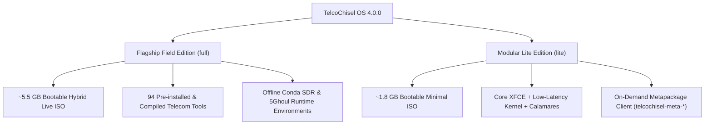

# TelcoChisel OS — Release Management & Versioning Framework

This document defines the release architecture, semantic versioning standards, build flavors, and distribution pipelines for **TelcoChisel OS**.

---

## 1. Release Versioning Scheme

TelcoChisel adheres strictly to **Semantic Versioning 2.0.0 (`MAJOR.MINOR.PATCH`)**:

| Component | Scope | Trigger Criteria |
| :--- | :--- | :--- |
| **`MAJOR`** (e.g., `4.0.0`) | Architectural Overhaul | Base OS distribution upgrades (e.g. Ubuntu LTS baseline), breaking changes in core kernel architecture, or major framework redesigns. |
| **`MINOR`** (e.g., `4.1.0`) | Domain Expansions & Features | Adding new telecom sub-domain toolchains (e.g. O-RAN / 5G SBI / NTN), new diagnostic engines, major hardware transceiver drivers, or desktop additions. |
| **`PATCH`** (e.g., `4.0.1`) | Security & Bug Fixes | Tool bug fixes, CVE security patches, driver updates, and installer stability enhancements. |

The canonical release version is tracked in the root [VERSION](file:///m:/TelcoChiselOS/VERSION) file and Git release tags (`v4.0.0`).

---

## 2. Release Channels

| Channel | Cadence | Artifact Target | Target Audience |
| :--- | :--- | :--- | :--- |
| **Stable (`v*.*.*`)** | Tagged Milestones | GitHub Releases + SourceForge (`/TelcoChisel/v4.0.0/`) | Production field researchers, lab auditors, and enterprise telecom security teams. |
| **Nightly Rolling** | Weekly / Automated Trigger | SourceForge (`/TelcoChisel/nightly/`) | Core contributors, CI regression testing, and bleeding-edge protocol validation. |

---

## 3. Distribution Flavors

TelcoChisel is published in two official edition flavors:



### 1. Flagship Field Edition (`full` — Default)
- **Artifact**: `TelcoChisel-<version>-amd64.iso` (~5.5 GB)
- **Characteristics**: 100% self-contained, air-gapped field workstation with all 94 telecom security tools pre-compiled and pre-configured.
- **Includes**: Real-time low-latency kernel, SDR transceivers, O-RAN, 5G Core, SIM/eSIM, and 5Ghoul fuzzer environments.

### 2. Modular Lite Edition (`lite`)
- **Artifact**: `TelcoChisel-<version>-lite-amd64.iso` (~1.8 GB)
- **Characteristics**: Streamlined footprint for fast deployment and cloud instances.
- **Includes**: Base XFCE desktop, Wireshark, network analysis tools, and `telcochisel-pkg` client to pull domain suites on demand from `meta.telcosec.net`.

---

## 4. Build Artifacts & Integrity Verification

Every release build generates a standard quartet of integrity assets:

```
├── TelcoChisel-4.0.0-amd64.iso                  # Hybrid UEFI/BIOS Bootable ISO
├── TelcoChisel-4.0.0-amd64.iso.sha256           # SHA-256 Checksum Verification
├── TelcoChisel-4.0.0-amd64.iso.md5              # MD5 Legacy Hash
└── TelcoChisel-4.0.0-amd64.iso.build-info.json  # Reproducibility Metadata & Tool Inventory
```

### Build Info Manifest Example:
```json
{
  "project": "TelcoChisel OS",
  "version": "4.0.0",
  "flavor": "full",
  "build_date": "2026-09-22T08:12:00Z",
  "base_os": "Ubuntu 24.04 LTS (Noble Numbat)",
  "kernel": "linux-image-lowlatency (6.8.0-lowlatency)",
  "sha256": "1e2d14b72799fe4b490f230722bb3d6e5d8a68a571ea3a669bc029ca99f4bf88",
  "tool_count": 94
}
```

---

## 5. Automated CI/CD Release Pipeline

Releases are triggered automatically via `.github/workflows/release.yml`:

1. **Tag Push**: `git tag v4.0.0 && git push origin v4.0.0`
2. **Workflow Dispatch**: Triggers manual bump (`major`, `minor`, `patch`, or `nightly`) with flavor selector (`full` / `lite`).
3. **Multi-Mirror Synchronization**:
   - Pushes release assets and checksums to GitHub Releases.
   - Synchronizes ISO files and README documentation to SourceForge (`frs.sourceforge.net`).
   - Generates and uploads the static offline docs portal.
