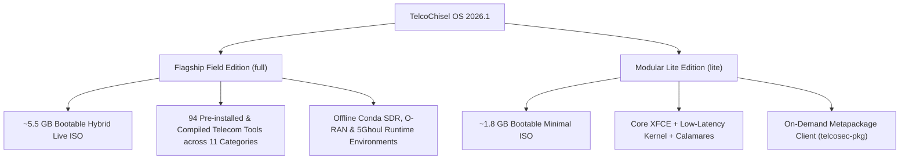

# TelcoChisel OS — Release Management & Versioning Framework

This document defines the release architecture, versioning standards, build flavors, and distribution pipelines for **TelcoChisel OS**.

---

## 1. Release Versioning Scheme

TelcoChisel adheres to a **Date-Based Rolling / Quarterly Release Model (`YYYY.R`)**, aligned with specialized security and penetration testing operating system conventions (e.g., Kali Linux, Parrot Security):

| Release Format | Cadence | Scope & Criteria |
| :--- | :--- | :--- |
| **`YYYY.1`** (e.g., `2026.1`) | Q1 (March) | Annual flagship baseline with updated Ubuntu LTS upstream components, refreshed low-latency real-time kernel, updated SDR driver frameworks, and toolchain additions. |
| **`YYYY.2`** (e.g., `2026.2`) | Q2 (June) | Mid-year feature release introducing new telecom sub-domain toolsets (e.g., O-RAN / 5G SBI / NTN), hardware transceiver updates, and GUI enhancements. |
| **`YYYY.3`** (e.g., `2026.3`) | Q3 (September) | Late-summer refresh focusing on cellular security playbooks, fuzzer suites (5Ghoul, SBI fuzzers), and protocol dissector updates. |
| **`YYYY.4`** (e.g., `2026.4`) | Q4 (December) | Year-end stabilization release incorporating upstream security advisories, bug fixes, and offline FPGA bitstream updates. |
| **`YYYY.R.P`** (e.g., `2026.1.1`) | Out-of-Band Hotfix | Critical CVE security patches, hotfixes for installer bugs, or emergency hardware driver corrections. |

The canonical release version is tracked in the root [VERSION](file:///m:/TelcoChiselOS/VERSION) file and Git release tags (`v2026.1`).

---

## 2. Release Channels

| Channel | Cadence | Artifact Target | Target Audience |
| :--- | :--- | :--- | :--- |
| **Stable (`vYYYY.R`)** | Quarterly Milestones | GitHub Releases + SourceForge (`/TelcoChisel/v2026.1/`) | Production field researchers, lab auditors, and enterprise telecom security teams. |
| **Nightly Rolling** | Automated / Triggered | GitHub Releases ([`rolling`](https://github.com/TelcoSec-Tools/TelcoChiselOS/releases/tag/rolling)) + SourceForge (`/TelcoChisel/nightly/`) | Core contributors, CI regression testing, and bleeding-edge protocol validation. |

---

## 3. Distribution Flavors

TelcoChisel is published in two official edition flavors:



### 1. Flagship Field Edition (`full` — Default)
- **Artifact**: `TelcoChisel-2026.1-amd64.iso` (~5.5 GB)
- **Characteristics**: 100% self-contained, air-gapped field workstation with all 94 telecom security tools pre-compiled and pre-configured.
- **Includes**: Real-time low-latency kernel, SDR transceivers, O-RAN, 5G Core, SIM/eSIM, and 5Ghoul fuzzer environments.

### 2. Modular Lite Edition (`lite`)
- **Artifact**: `TelcoChisel-2026.1-lite-amd64.iso` (~1.8 GB)
- **Characteristics**: Streamlined footprint for fast deployment and cloud instances.
- **Includes**: Base XFCE desktop, Wireshark, network analysis tools, and `telcosec-pkg` client to pull domain suites on demand from `meta.telcosec.net`.

---

## 4. Build Artifacts & Integrity Verification

Every release build generates a standard quartet of integrity assets:

```
├── TelcoChisel-2026.1-amd64.iso                  # Hybrid UEFI/BIOS Bootable ISO
├── TelcoChisel-2026.1-amd64.iso.sha256           # SHA-256 Checksum Verification
├── TelcoChisel-2026.1-amd64.iso.md5              # MD5 Legacy Hash
└── TelcoChisel-2026.1-amd64.iso.build-info.json  # Reproducibility Metadata & Tool Inventory
```

### Build Info Manifest Example:
```json
{
  "project": "TelcoChisel OS",
  "version": "2026.1",
  "flavor": "full",
  "build_date": "2026-09-22T08:12:00Z",
  "base_os": "Ubuntu 24.04 LTS (Noble Numbat)",
  "kernel": "linux-image-lowlatency (6.8.0-lowlatency)",
  "sha256": "1e2d14b72799fe4b490f230722bb3d6e5d8a68a571ea3a669bc029ca99f4bf88",
  "tool_count": 94
}
```

---

## 5. Automated CI/CD Release Pipeline

Releases are triggered automatically via `.github/workflows/release.yml`:

1. **Tag Push**: `git tag v2026.1 && git push origin v2026.1`
2. **Workflow Dispatch**: Triggers manual bump (`2026.1`, `2026.2`, `2026.3`, `2026.4`, or `nightly`) with flavor selector (`full` / `lite`).
3. **Multi-Mirror Synchronization**:
   - Pushes release assets and checksums to GitHub Releases.
   - Synchronizes ISO files and README documentation to SourceForge (`frs.sourceforge.net`).
   - Generates and uploads the static offline docs portal.
