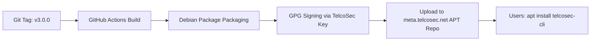

# Architectural Blueprint: Dedicated `telcosec-cli` Repository

**Project Proposal & Technical Specification for Standalone CLI Tooling**  
*TelcoSec Engineering Architecture · Target Repository: `TelcoSec-Tools/telcosec-cli`*

---

## 1. Executive Summary & Strategic Rationale

Currently, the `telcosec` CLI command center and its companion utilities (`telcosec-sdr`, `telcosec-pkg`, `telcosec-create-usb`) are maintained in-tree inside the [TelcoChiselOS](https://github.com/TelcoSec-Tools/TelcoChiselOS) repository under `builder/scripts/bin/`.

While this in-tree model was sufficient during early OS prototyping, separating the CLI suite into a **dedicated open-source repository** (`TelcoSec-Tools/telcosec-cli`) unlocks decisive advantages:

| Dimension | Monolithic In-Tree Model | Dedicated `telcosec-cli` Repository |
| :--- | :--- | :--- |
| **Portability & Reach** | Restricted to operators booting the 5.0 GB TelcoChisel ISO. | Installable on **any** Linux distribution: Ubuntu 24.04/22.04, Debian 12, Kali Linux, DragonOS, Fedora, Arch Linux, Raspberry Pi. |
| **Release Velocity** | Releasing CLI improvements requires rebuilding and redistributing a multi-gigabyte ISO. | Independent semantic versioning (`v3.1.0`, `v3.1.1`) with instant delivery via `apt-get update && apt-get upgrade telcosec-cli`. |
| **Packaging Modularity** | Shell scripts installed manually into `/usr/local/bin`. | Standardized native Debian package (`telcosec-cli_amd64.deb`), binary tarballs, and Homebrew tap. |
| **Contribution Ergonomics** | Contributors must understand debootstrap, squashfs, and live-build to touch CLI code. | Clean, isolated codebase with dedicated unit tests, mock hardware fixtures, and sub-10-second CI builds. |

---

## 2. Proposed Repository Architecture

```text
telcosec-cli/
├── cmd/
│   └── telcosec/                     # Main CLI entrypoint
│       └── main.go (or main.sh)
├── pkg/
│   ├── sdr/                          # SDR transceiver discovery & diagnostics
│   │   ├── uhd.go                    # Ettus USRP UHD probe & FPGA bitstream inspection
│   │   ├── bladerf.go                # Nuand BladeRF 2.0 micro probe & autoloading
│   │   ├── hackrf.go                 # Great Scott Gadgets HackRF One & Rad1o probe
│   │   ├── limesdr.go                # Lime Microsystems LimeSuite probe
│   │   └── rtlsdr.go                 # RTL-SDR direct sampling & frequency check
│   ├── network/                      # 10GbE SFP+ & High-Throughput NIC optimization
│   │   ├── tuning.go                 # MTU 9000, 4096 ring descriptors, 64MB socket buffers
│   │   └── probe.go                  # Kernel network interface enumeration
│   ├── cellular/                     # 5G Standalone & 4G LTE core management
│   │   ├── open5gs.go                # Open5GS service lifecycle (systemd) & AMF/UPF healthcheck
│   │   ├── subscriber.go             # open5gs-dbctl subscriber provisioning (IMSI, K, OPc)
│   │   ├── ueransim.go               # UERANSIM gNodeB & UE session launcher
│   │   └── srsran.go                 # srsRAN 4G/5G testbed launcher
│   ├── sim/                          # Smartcard, SIM, and eSIM auditing
│   │   ├── pcsc.go                   # PC/SC daemon healthcheck & reader polling
│   │   ├── atr.go                    # ISO 7816 Answer-to-Reset decoder
│   │   └── lpac.go                   # eSIM Local Profile Assistant interface
│   ├── protocol/                     # Signaling audit & assessment wizards
│   │   ├── sctp.go                   # SCTP scanner & multihoming probe
│   │   ├── sip.go                    # SIPVicious SVMap runner & SIP digest checker
│   │   └── diameter.go               # Diafuzzer runner & Diameter dictionary parser
│   ├── package_manager/              # Metapackage client for meta.telcosec.net
│   │   ├── client.go                 # Querying packages from meta.telcosec.net
│   │   └── tui.go                    # Terminal UI / curses interactive installer
│   └── telemetry/                    # Kernel and system telemetry
│       ├── kernel.go                 # Real-time latency, timer resolution (1000Hz)
│       ├── limits.go                 # PAM limits (RLIMIT_MEMLOCK, SCHED_RR)
│       └── usbfs.go                  # usbfs_memory_mb inspection & allocation
├── debian/                           # Native Debian packaging control files
│   ├── changelog
│   ├── compat
│   ├── control
│   ├── rules
│   └── install
├── completions/                      # Shell completions (Bash, Zsh, Fish)
│   ├── telcosec.bash
│   └── _telcosec (zsh)
├── docs/                             # Manpages and CLI command reference
│   └── telcosec.1.ronn
├── .github/
│   ├── workflows/
│   │   ├── ci.yml                    # Syntax, unit tests, linting
│   │   ├── release.yml               # Automated release & APT repo upload
│   │   └── sync-mirror.yml           # Mirroring to SourceForge git
│   └── ISSUE_TEMPLATE/
├── Makefile
├── LICENSE (Apache-2.0)
└── README.md
```

---

## 3. Command Line Interface Specification

The standalone `telcosec` CLI will expose a structured, hierarchical command set:

```bash
# 1. System & Telemetry
telcosec check                        # Run comprehensive pre-flight healthcheck
telcosec status                       # Detailed kernel, PAM limits, and service telemetry
telcosec profile [lab|field|status]   # Toggle packet crafting vs firewall profile

# 2. Hardware Diagnostics
telcosec hardware                     # Comprehensive probe of all connected radio/SIM/modem hardware
telcosec sdr status                   # Scan attached SDR transceivers (UHD, HackRF, BladeRF, LimeSDR)
telcosec sdr usb                      # Audit and tune USB 3.0 usbfs memory buffer
telcosec sdr 10g [tune|status]        # Tune 10GbE network interfaces for USRP X310/N310
telcosec sdr firmware [list|download] # Inspect or fetch offline FPGA bitstreams

# 3. 5G/4G Core & RAN Operations
telcosec 5g-sa start                  # Spin up local Open5GS 5G Standalone core network
telcosec 5g-sa stop                   # Gracefully tear down 5G core services
telcosec 5g-sa status                 # Check status of AMF, SMF, UPF, NRF, AUSF, UDM
telcosec 5g-sa add-sub <imsi> [k] [opc] # Provision subscriber credentials into MongoDB

# 4. SIM / eSIM Auditing
telcosec sim readers                  # List attached PC/SC smartcard readers
telcosec sim atr                      # Read and parse Answer-to-Reset from inserted SIM
telcosec sim trace [interface]        # Capture APDUs via SIMtrace 2 probe

# 5. Signaling Assessment Wizards
telcosec scan sctp <target-ip>        # Scan SCTP signaling endpoints & multihomed paths
telcosec scan sip <target-ip>         # Map SIP user agents and extension enumeration
telcosec scan diameter <target-ip>    # Send Diameter capabilities-exchange-request (CER)

# 6. Documentation & Community
telcosec search <keyword>             # Search the 88-tool catalog for matching tools
telcosec docs                         # Open interactive offline documentation in browser
telcosec academy                      # Launch TelcoSec Academy field lab bridge
telcosec feedback                     # Direct SourceForge review portal launcher
telcosec version                      # Display TelcoSec CLI and OS version details
```

---

## 4. Packaging & Distribution Pipeline

### 4.1 Native APT Repository (`meta.telcosec.net`)
The dedicated repository will build Debian packages (`telcosec-cli_3.0.0_amd64.deb` and `arm64`) using GitHub Actions:



Operators on **any** Debian/Ubuntu system can install `telcosec-cli` in 2 commands:
```bash
curl -fsSL https://meta.telcosec.net/telcosec.gpg | sudo gpg --dearmor -o /etc/apt/keyrings/telcosec.gpg
echo "deb [signed-by=/etc/apt/keyrings/telcosec.gpg] https://meta.telcosec.net noble main" | sudo tee /etc/apt/sources.list.d/telcosec.list
sudo apt-get update && sudo apt-get install -y telcosec-cli
```

### 4.2 Portable Binary & Container Distribution
- **Standalone Static Binaries**: Distributed as single-file binaries on GitHub Releases for systems where root APT installation is restricted.
- **Micro-Container**: Lightweight Alpine/Ubuntu container (`telcosec/telcosec-cli:latest`) for CI/CD pipelines and cloud testbeds.

---

## 5. Migration Roadmap from TelcoChiselOS

| Milestone | Deliverables | Target Timeline |
| :--- | :--- | :--- |
| **M1: In-Tree Harmonization** | Upgrade in-tree `builder/scripts/bin/telcosec` to v3.0.0, implement `docs`, `search`, `check`, `5g-sa` aliases. *(Completed)* | Immediate |
| **M2: Repository Creation** | Initialize `TelcoSec-Tools/telcosec-cli` on GitHub with Apache-2.0 license, CI, and issue templates. | Q4 2026 |
| **M3: Modular Package Architecture** | Implement modular subcommands, unit tests with mocked USB/SDR responses, and shell completions. | Q4 2026 |
| **M4: APT Repository Integration** | Configure `.github/workflows/deploy-apt.yml` in `telcosec-cli` to build and sign `.deb` packages for `meta.telcosec.net`. | Q1 2027 |
| **M5: TelcoChiselOS Decoupling** | Update `TelcoChiselOS` build scripts to install `telcosec-cli` via `apt-get install -y telcosec-cli`, replacing in-tree scripts. | Q1 2027 |
