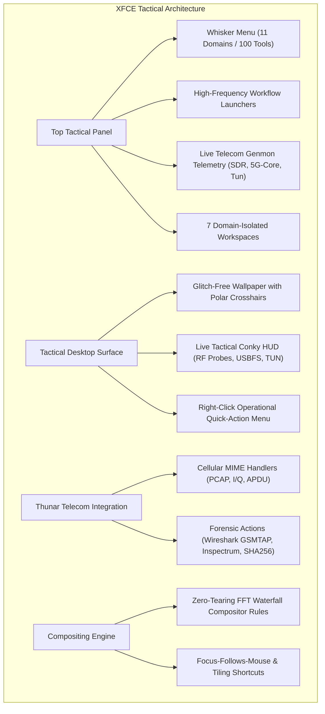
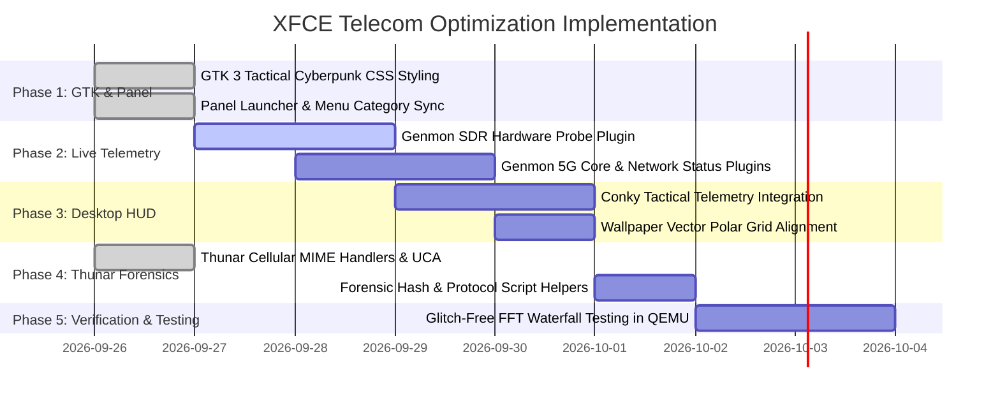

# TelcoChisel OS — XFCE Desktop Environment Optimization Plan
**Domain:** Telecom Security, Cellular Red Teaming, RF Spectrum Analysis, and Mission Workflows

---

## 1. Executive Summary & Vision

While typical Linux distributions treat XFCE as a generic low-resource desktop, **TelcoChisel OS** transforms XFCE into a **mission-critical, zero-latency, high-visibility tactical command workstation**.

Telecom security practitioners face unique operational requirements:
1. **High Data Throughput & Zero-Drop Visuals**: Software Defined Radio (SDR) tools like Gqrx, Inspectrum, and Universal Radio Hacker (URH) render multi-megasample-per-second FFT waterfalls that stutter under poor compositing or heavy window managers.
2. **Multi-Domain Workflow Isolation**: Auditing a carrier network requires simultaneously managing RF transceivers, cellular core protocol daemons, air-interface packet dissections, and SIM smartcard APDU exchanges.
3. **Hostile Field Visibility**: Operations in bright field environments (rooftops, cell towers, base stations) or dark operational control rooms demand high-contrast palettes with instantaneous status recognition.
4. **Instant Diagnostic Telemetry**: Operators must know at a glance whether their USRP B210 has fallen back to USB 2.0, whether `ogstun` is up, or whether `mon0` is actively capturing GSMTAP packets.



---

## 2. Design System & Visual Tokens

The desktop aesthetic is anchored in a **Tactical Cyberpunk** theme, harmonizing with the TelcoSec documentation portal, Calamares installer, and tmux matrix:

| Token Name | Hex Code | RGB | Purpose |
| :--- | :--- | :--- | :--- |
| **Canvas Background** | `#0a0e17` | `10, 14, 23` | Deep navy base; eliminates eye strain during night audits |
| **Card / Surface Dark** | `#0e121a` | `14, 18, 26` | Panel, window chrome, menu backgrounds, and terminal canvas |
| **Surface Elevate** | `#161b22` | `22, 27, 34` | Hover states, active list rows, input fields |
| **Accent Primary (Cyan/Teal)** | `#00ffd5` | `0, 255, 213` | Active selections, workspace highlights, status indicators, focus rings |
| **Accent Secondary (Electric Amber)** | `#e8921e` | `232, 146, 30` | Warnings, telemetry tags, ProLabs highlights, RF transmission warnings |
| **Alert Red (Coral)** | `#ff4466` | `255, 68, 102` | Critical alerts, core service failure, packet drop warnings |
| **Border Subtle** | `#21262d` | `33, 38, 45` | Window boundaries, panel dividers, widget borders |
| **Text Primary** | `#e6edf3` | `230, 237, 243` | Clean high-contrast readability across all monitors |
| **Text Muted** | `#8b949e` | `139, 148, 158` | Secondary labels, descriptions, timestamps |

### Typography Hierarchy
* **Desktop UI & Menus**: `Ubuntu 10pt / 11pt Regular & Bold` — Crisp legibility at 96 and 144 DPI.
* **Terminals & Telemetry**: `IBM Plex Mono 11pt / 12pt` — Monospaced clarity for hex dumps, IMSI strings, and APDU traces.

---

## 3. Panel Architecture & Telecom Telemetry

A single **34px Top Tactical Panel** maximizes vertical screen real estate for spectrum waterfalls and packet traces.

```
+---------------------------------------------------------------------------------------------------------------+
| [TelcoChisel] | [Term] [Matrix] [ProLabs] [Academy] [Wireshark] [Gqrx] [pySim] [Docs] | [Tasklist...]          |
|                                                                                                               |
|               [📡 USRP B210] [📶 5G-UP] [🛡️ VPN] | [1:RF] [2:GSM] [3:5G] [4:LAB] [5:ACAD] [6:PCAP] [7:DOC] | 🕒 |
+---------------------------------------------------------------------------------------------------------------+
```

### A. Left: Application Navigation & Quick Launchers
1. **Whisker Menu**:
   - Custom `telcosec` SVG icon with "TelcoChisel" text.
   - Categorized into the **11 canonical telecom security domains**:
     1. SDR & Spectrum Analysis
     2. GSM / 2G Cellular
     3. LTE / 4G Cellular
     4. 5G NR & O-RAN
     5. Baseband & Firmware
     6. SIM & eSIM Smartcard
     7. Core Signaling (SS7, Diameter, 5G SBI)
     8. Device Tools & Modems
     9. Network Analysis & Routing
     10. VoIP & IMS Messaging
     11. Wordlist Tools & Chisel
   - Pre-configured search index containing all 100 installed tools.
2. **Tactical Quick Launchers**:
   - **Terminator Matrix**: 4-pane live command & control console (`telcosec-tmux-redteam`).
   - **TelcoSec ProLabs**: Remote carrier cyber ranges and 5G testbeds.
   - **TelcoSec Academy**: Interactive practice labs and exercise datasets.
   - **Wireshark (GSMTAP)**: Instant packet capture with pre-applied `gsmtap` dissectors.
   - **Gqrx SDR**: Spectrum receiver and FFT waterfall.
   - **pySim-shell**: Smartcard APDU explorer and profile management.
   - **TelcoSec Docs**: Offline comprehensive documentation portal.

### B. Center: Tasklist with Accent State
- Expanding tasklist with window grouping enabled.
- Flat buttons with a 2px `#00ffd5` bottom glow indicator for the active window.
- Middle-click to immediately terminate/close stuck or hung process windows.

### C. Right-Center: Live Telecom Genmon Telemetry Plugins
Using `xfce4-genmon-plugin`, three live monitors refresh every 3 seconds:
1. **SDR Hardware Probe (`genmon-sdr`)**:
   - Runs `telcosec-ran-status --summary`.
   - Displays icon + attached device name: e.g. `📡 USRP B210`, `📡 HackRF`, `📡 LimeSDR`, or `📡 [No SDR]`.
   - Tooltip reveals USB transfer speed (USB 3.0 vs USB 2.0 fallback warning) and serial number.
   - Clicking opens the full **TelcoSec Hardware Probe** window.
2. **Cellular Core Status (`genmon-core`)**:
   - Monitors Open5GS (`open5gs-amfd`, `open5gs-upfd`), srsRAN, or UERANSIM.
   - Displays `📶 5G-SA (UP)` in cyan, `📶 Core-TUN` in amber, or `📶 Standby` in muted gray.
   - Clicking launches the **5G SA Core Status** diagnostic dashboard.
3. **Network & Tunnel Status (`genmon-net`)**:
   - Checks status of `ogstun`, `mon0`, `wg0`, or `tun0`.
   - Displays `🛡️ ProLabs`, `🛡️ WG-VPN`, or `🛡️ Direct`.

### D. Right: 7-Workspace Pager & Systray
7 Dedicated Workspaces pre-configured with distinct domain identities:
* **`📡 1: RF-DSP`**: Signal processing, FFT waterfalls (Gqrx, URH, Inspectrum, GNU Radio).
* **`📻 2: GSM-RAN`**: 2G/3G base station emulation and scanning (Osmocom, OpenBTS, YateBTS, Kalibrate).
* **`⚡ 3: CORE-5G`**: 5G SA / LTE core stacks (Open5GS, UERANSIM, srsRAN, 5Ghoul).
* **`🧪 4: PRO-LABS`**: Remote carrier testbeds and cyber ranges.
* **`🎓 5: ACADEMY`**: Practice modules, CTF challenges, documentation.
* **`🔍 6: DISSECT`**: Packet captures, protocol analysis (Wireshark, TShark, SCAT).
* **`📝 7: EVIDENCE`**: Reporting, note-taking, forensic evidence storage.

---

## 4. Desktop Surface & Live Tactical HUD (Conky)

A semi-transparent, glare-resistant **Conky Tactical HUD** is integrated directly into the desktop background (non-intrusive, right-aligned):

```
+-------------------------------------------------------------+
| 📡 TELCOCHISEL OS — TACTICAL HUD                            |
| Kernel: 6.8.0-lowlatency (RT Priority Enabled)              |
| Uptime: 2h 14m | UTC: 14:32:05 | Host: telcochisel          |
+-------------------------------------------------------------+
| 📻 RF HARDWARE STATUS                                       |
|  - USRP B210 (2500:0021) : CONNECTED (USB 3.0 xHCI)         |
|  - USBFS Memory Buffer   : 1000 MB [OK - Zero-Drop]         |
|  - UHD Master Clock Rate : 30.72 MHz (5G NR Ready)          |
+-------------------------------------------------------------+
| ⚡ CELLULAR NETWORK INTERFACES                              |
|  - ogstun (5G Core)      : 10.45.0.1/16 [ACTIVE]            |
|  - mon0 (GSMTAP Sniff)   : RF Monitor [UP]                  |
|  - eth0 (Bridged MGMT)   : 192.168.1.150/24                 |
|  - tun-prolabs (Range)   : 10.200.5.2 [CONNECTED]           |
+-------------------------------------------------------------+
| 🎯 FREQUENCY CHEATSHEET                                     |
|  - GSM-900  : Uplink 890-915 MHz | Downlink 935-960 MHz     |
|  - LTE B3   : Uplink 1710-1785 MHz | Downlink 1805-1880 MHz |
|  - 5G n78   : 3300 - 3800 MHz (C-Band TDD)                  |
+-------------------------------------------------------------+
| ⌨️ OPERATIONAL HOTKEYS                                      |
|  Super+Shift+W : Wireshark GSMTAP                           |
|  Super+Shift+G : Gqrx SDR Receiver                          |
|  Super+Shift+S : pySim-shell                                |
|  Super+F1..F6  : Telecom Diagnostics Doctor                 |
+-------------------------------------------------------------+
```

---

## 5. Thunar File Manager: Telecom Integration

Thunar is customized with dedicated MIME handlers and contextual forensic actions:

### A. Contextual Right-Click Actions (`uca.xml`)
* **Cellular Captures (`*.pcap`, `*.pcapng`, `*.cap`)**:
  * *Analyze in Wireshark (GSMTAP)*: Launches `wireshark -k -Y gsmtap %f`.
  * *Extract IMSI / TMSI with SCAT*: Runs `scat -t qc -i %f` in Terminator.
  * *Filter SCTP / NGAP / NAS-5GS*: Launches TShark filter extracting 5G NAS messages.
* **RF I/Q Recordings (`*.cfile`, `*.iq`, `*.raw`, `*.bin`, `*.cs8`, `*.cs16`, `*.cf32`)**:
  * *Inspect Spectrum in Inspectrum*: Launches `inspectrum %f`.
  * *Demodulate in URH*: Launches Universal Radio Hacker.
  * *Open in GNU Radio Companion*: Generates a file-source flowgraph.
* **SIM & Smartcard Scripts (`*.apdu`, `*.pysim`, `*.sim`, `*.txt`)**:
  * *Execute APDU Batch in pySim-shell*: Automatically connects to PC/SC reader and runs sequence.
* **Forensic Chain-of-Custody (Any File)**:
  * *Compute SHA-256 Forensic Hash*: Displays cryptographic checksum with timestamp for reporting.

### B. Custom Sidebar Bookmarks
* `file:///usr/share/wordlists/telecom` — Telecom Wordlists (MCC/MNC, APNs, IMSI pools, carrier passwords).
* `file:///opt/telcosec` — TelcoSec Source Tools & Git Repositories.
* `file:///usr/share/doc/telcosec` — Local Offline Telecom Security Knowledgebase.
* `file:///home/telcosec/captures` — Captures directory for PCAPs and raw I/Q dumps.

---

## 6. Window Manager & Compositing Optimization

High-sample-rate SDR applications can suffer severe buffer overruns or dropped frames if the X11 window manager drops VSync or locks threads.

### A. Xfwm4 & Picom Compositor Tuning
* **Compositor Backend**: `glx` (OpenGL hardware acceleration) with `vsync = true` and `glx-no-stencil = true`.
* **Zero-Drop Rule for FFT Windows**:
  * Full opacity (100%) and zero shadow overhead enforced for `Gqrx`, `Inspectrum`, `URH`, `Wireshark`, and `GNU Radio`.
  * Prevents window compositor caching from throttling OpenGL waterfall redraw rates.
* **Unredirect Overlays**:
  * Xfwm4 `unredirect_overlays=true` bypasses compositor overhead entirely for full-screen analysis windows.
* **Tiling & Snap Grid**:
  * Snap to border and snap to other windows enabled with 10px threshold.
  * Native 50/50 horizontal and vertical split tiling keybindings (`Super+Left`, `Super+Right`, `Super+Up`, `Super+Down`).

---

## 7. Ergonomic Keyboard Shortcuts Matrix

| Keybinding | Function | Target / Executable |
| :--- | :--- | :--- |
| **`Super` (Windows key)** | Open Whisker Menu & Search | `xfce4-popup-whiskermenu` |
| **`Super + Return`** or **`Ctrl + Alt + T`** | Open Terminator Terminal | `terminator` |
| **`Super + E`** | Open Thunar File Manager | `thunar` |
| **`Super + L`** | Lock Tactical Screen | `xflock4` |
| **`Super + 1` .. `7`** | Switch to Workspace 1 through 7 | `workspace_1_key` .. `7` |
| **`Super + Left / Right`** | Tile Window Left / Right (50/50) | `tile_left_key` / `tile_right_key` |
| **`Super + Up / Down`** | Maximize / Restore Window | `maximize_window_key` |
| **`Super + Shift + W`** | Wireshark GSMTAP Capture | `wireshark -k -Y gsmtap` |
| **`Super + Shift + G`** | Gqrx SDR Waterfall | `gqrx` |
| **`Super + Shift + S`** | pySim-shell SIM Explorer | `terminator -e pysim-shell` |
| **`Super + Shift + T`** | 4-Pane Operator Matrix | `telcosec-tmux-redteam` |
| **`Super + Shift + X`** | Launch TelcoSec ProLabs | `telcosec-prolabs open` |
| **`Super + Shift + M`** | Launch TelcoSec Academy | `telcosec-academy open` |
| **`Super + Shift + D`** | Open Offline Documentation | `firefox /usr/share/doc/telcosec/index.html` |
| **`Super + F1`** | Run Pre-flight Diagnostic Doctor | `telcosec check` |
| **`Super + F2`** | Probe SDR Hardware & USB Speeds | `telcosec hardware` |
| **`Super + F3`** | Check 5G SA Core Status | `telcosec 5g-sa status` |
| **`Super + F4`** | Apply 10GbE / Zero-Drop Network Tune | `sudo telcosec sdr 10g tune` |
| **`Super + F5`** | ProLabs Range VPN Status | `telcosec prolabs status` |
| **`Super + F6`** | Academy Course Status | `telcosec academy status` |

---

## 8. Implementation Phases & Roadmap



### Next Action Items:
1. **Implement `xfce4-genmon-plugin` telemetry scripts**:
   - Create `/usr/local/bin/telcosec-genmon-sdr` to output formatted XML with SDR detection status, tooltip, and click action.
   - Create `/usr/local/bin/telcosec-genmon-core` to output formatted XML with 5G Core status and tunnel indicators.
   - Add `xfce4-genmon-plugin` to `PKGS_BASE` in `builder/scripts/lib/packages.sh`.
2. **Implement Tactical Desktop Conky HUD**:
   - Write `/etc/skel/.config/conky/telcosec-hud.conf` and `/etc/xdg/autostart/telcosec-conky.desktop`.
   - Add `conky-all` to `PKGS_BASE`.
3. **Harmonize Panel XML Configurations**:
   - Update `xfce4-panel.xml` in `05-desktop-customization.sh` to insert the new Genmon telemetry items between the tasklist and pager.
